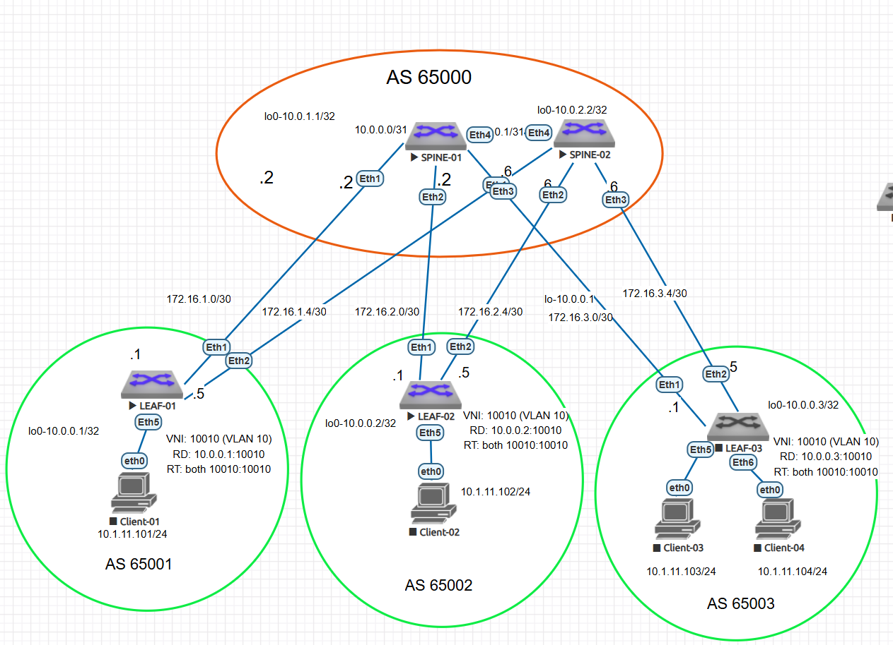

### Overlay на основе VxLAN EVPN для L2 связанности между клиентами.

Цель:
- Настроить BGP peering между Leaf и Spine в AF l2vpn evpn
- Настроить связанность между клиентами в первой зоне и убедитесь в её наличии
- Зафиксировать в документации - план работы, адресное пространство, схему сети, конфигурацию устройств

В этой самостоятельной работе:

- был настроен eBGP в Underlay сети для IP связанности между всеми сетевыми устройствами.
- выделено адресное пространство
- подготовлена схема сети 
- сконфигурированы 2 spine, 3 leaf коммутатора 
- проверена ip связность между всеми устройствами в BGP-домене
- Настроен BGP peering между Leaf и Spine в AF l2vpn evpn
- Настроить связанность между клиентами в первой зоне
- проверена связность 


### Схема 



Была выбрана следующая адресация для Underlay: 

loopback-адреса 

Spine-01 10.0.1.1/32
Spine-02 10.0.2.2/32
Leaf-01 10.0.0.1/32
Leaf-02 10.0.0.2/32
Leaf-03 10.0.0.3/32

Топология p2p связей. В этой работе использовала /30 адреса для более легкого траблшутинга.

 ###Связи между SPINE-01 и LEAF-коммутаторами

 
 SPINE-01 ↔ LEAF-01
 Сеть: 172.16.1.0/30
 SPINE-01 (интерфейс Eth1): 172.16.1.2
 LEAF-01 (интерфейс Eth1): 172.16.1.1

 
 SPINE-01 ↔ LEAF-02
 Сеть: 172.16.2.0/30
 SPINE-01 (интерфейс Eth2): 172.16.2.2
 LEAF-02 (интерфейс Eth1): 172.16.2.1

 
 SPINE-01 ↔ LEAF-03
 Сеть: 172.16.3.0/30
 SPINE-01 (интерфейс Eth3): 172.16.3.2
 LEAF-03 (интерфейс Eth1): 172.16.3.1
 
 
 ###Связи между SPINE-02 и LEAF-коммутаторами
 SPINE-02 ↔ LEAF-01
 Сеть: 172.16.1.4/30
 SPINE-02 (интерфейс Eth1): 172.16.1.6
 LEAF-01 (интерфейс Eth2): 172.16.1.5

 
 SPINE-02 ↔ LEAF-02
 Сеть: 172.16.2.4/30
 SPINE-02 (интерфейс Eth2): 172.16.2.6
 LEAF-02 (интерфейс Eth2): 172.16.2.5

 
 SPINE-02 ↔ LEAF-03
 Сеть: 172.16.3.4/30
 SPINE-02 (интерфейс Eth3): 172.16.3.6
 LEAF-03 (интерфейс Eth2): 172.16.3.5


|Устройство|Интерфейс|IP-адрес и Маска|Тип подключения|Назначение 
|---|---|---|---|---|
SPINE-01|lo0|10.0.1.1/32|Loopback Локальный Router ID
SPINE-01|Eth1|172.16.1.2/30|P2P Линк|LEAF-01 (Eth1)
SPINE-01|Eth2|172.16.2.2/30|P2P Линк|LEAF-02 (Eth1)
SPINE-01|Eth3|172.16.3.2/30|P2P Линк|LEAF-03 (Eth1)|
SPINE-02|lo0|10.0.2.2/32|Loopback Локальный Router ID|
SPINE-02|Eth1|172.16.1.6/30|P2P Линк|LEAF-01 (Eth2)
SPINE-02|Eth2|172.16.2.6/30|P2P Линк|LEAF-02 (Eth2)|
SPINE-02|Eth3|172.16.3.6/30|P2P Линк|LEAF-03 (Eth2)
LEAF-01|lo0|10.0.0.1/32|Loopback Локальный Router ID
LEAF-01|Eth1|172.16.1.1/30|P2P Линк|SPINE-01 (Eth1)
LEAF-01|Eth2|172.16.1.5/30|P2P Линк|SPINE-02 (Eth1)
LEAF-02|lo0|10.0.0.2/32|Loopback Локальный Router ID
LEAF-02|Eth1|172.16.2.1/30|P2P Линк|SPINE-01 (Eth2)
LEAF-02|Eth2|172.16.2.5/30|P2P Линк|SPINE-02 (Eth2)
LEAF-03|lo0|10.0.0.3/32|Loopback Локальный Router ID
LEAF-03|Eth1|172.16.3.1/30|P2P Линк|SPINE-01 (Eth3)
LEAF-03|Eth2|172.16.3.5/30|P2P Линк|SPINE-02 (Eth3)


### Tаблица параметров Overlay (EVPN / VXLAN)


| Устройство | Номер AS | Loopback0 IP (BGP / VTEP) | Роль в BGP EVPN | Соседи в Overlay (Peer IP) | Настройки VXLAN (VNI / RD / RT) |
| :--- | :---: | :---: | :--- | :--- | :--- |
| **SPINE-01** | 65000 | 10.0.1.1 | Route Reflector / Transit | 10.0.0.1 (Leaf-01)<br>10.0.0.2 (Leaf-02)<br>10.0.0.3 (Leaf-03) | Не терминирует VXLAN |
| **SPINE-02** | 65000 | 10.0.2.2 | Route Reflector / Transit | 10.0.0.1 (Leaf-01)<br>10.0.0.2 (Leaf-02)<br>10.0.0.3 (Leaf-03) | Не терминирует VXLAN |
| **LEAF-01** | 65001 | 10.0.0.1 | VTEP Endpoint | 10.0.1.1 (Spine-01)<br>10.0.2.2 (Spine-02) | VNI: 10010 (VLAN 10)<br>RD: 10.0.0.1:10010<br>RT: both 10010:10010 |
| **LEAF-02** | 65002 | 10.0.0.2 | VTEP Endpoint | 10.0.1.1 (Spine-01)<br>10.0.2.2 (Spine-02) | VNI: 10010 (VLAN 10)<br>RD: 10.0.0.2:10010<br>RT: both 10010:10010 |
| **LEAF-03** | 65003 | 10.0.0.3 | VTEP Endpoint | 10.0.1.1 (Spine-01)<br>10.0.2.2 (Spine-02) | VNI: 10010 (VLAN 10)<br>RD: 10.0.0.3:10010<br>RT: both 10010:10010 |


### Настройка оборудования 

Spine-01: 
```
SPINE-01#sh run
! Command: show running-config
! device: SPINE-01 (vEOS-lab, EOS-4.29.2F)
!
! boot system flash:/vEOS-lab.swi
!
no aaa root
!
transceiver qsfp default-mode 4x10G
!
service routing protocols model multi-agent
!
hostname SPINE-01
!
spanning-tree mode mstp
!
interface Ethernet1
   description to-Leaf-01-eth1
   mtu 9000
   no switchport
   ip address 172.16.1.2/30
   no ip ospf neighbor bfd
!
interface Ethernet2
   description to-Leaf-02-Eth1
   mtu 9000
   no switchport
   ip address 172.16.2.2/30
   no ip ospf neighbor bfd
!
interface Ethernet3
   description to-Leaf-03-Eth1
   mtu 9000
   no switchport
   ip address 172.16.3.2/30
   no ip ospf neighbor bfd
!
interface Ethernet4
   
   shutdown
   mtu 9214
   no switchport
!
interface Ethernet5
!
interface Ethernet6
!
interface Ethernet7
!
interface Ethernet8
!
interface Loopback0
   ip address 10.0.1.1/32
!
interface Management1
!
ip routing
!
ip route 8.8.8.0/24 Null0
!
router bgp 65000
   router-id 10.0.1.1
   no bgp default ipv4-unicast
   maximum-paths 4 ecmp 4
   neighbor EVPN-OVERLAY peer group
   neighbor EVPN-OVERLAY update-source Loopback0
   neighbor EVPN-OVERLAY ebgp-multihop 3
   neighbor EVPN-OVERLAY send-community extended
   neighbor 10.0.0.1 peer group EVPN-OVERLAY
   neighbor 10.0.0.1 remote-as 65001
   neighbor 10.0.0.1 description to-LEAF-01-EVPN
   neighbor 10.0.0.2 peer group EVPN-OVERLAY
   neighbor 10.0.0.2 remote-as 65002
   neighbor 10.0.0.2 description to-LEAF-02-EVPN
   neighbor 10.0.0.3 peer group EVPN-OVERLAY
   neighbor 10.0.0.3 remote-as 65003
   neighbor 10.0.0.3 description to-LEAF-03-EVPN
   neighbor 172.16.1.1 remote-as 65001
   neighbor 172.16.1.1 description to-LEAF-01-UNDERLAY
   neighbor 172.16.2.1 remote-as 65002
   neighbor 172.16.2.1 description to-LEAF-02-UNDERLAY
   neighbor 172.16.3.1 remote-as 65003
   neighbor 172.16.3.1 description to-LEAF-03-UNDERLAY
   !
   address-family evpn
      neighbor EVPN-OVERLAY activate
   !
   address-family ipv4
      neighbor 172.16.1.1 activate
      neighbor 172.16.2.1 activate
      neighbor 172.16.3.1 activate
      network 10.0.1.1/32
!
end
SPINE-01#
```

Настройки Spine-02

```
SPINE-02#sh run
! Command: show running-config
! device: SPINE-02 (vEOS-lab, EOS-4.29.2F)
!
! boot system flash:/vEOS-lab.swi
!
no aaa root
!
transceiver qsfp default-mode 4x10G
!
service routing protocols model multi-agent
!
no logging console
!
hostname SPINE-02
!
spanning-tree mode mstp
!
interface Ethernet1
   description to-Leaf01-eth2
   mtu 9000
   no switchport
   ip address 172.16.1.6/30
!
interface Ethernet2
   description to-Leaf-02-Eth2
   mtu 9000
   no switchport
   ip address 172.16.2.6/30
!
interface Ethernet3
   description to-Leaf-03-Eth2
   mtu 9000
   no switchport
   ip address 172.16.3.6/30
!
interface Ethernet4
   description UNUSED_INTERCONNECT_TO_SPINE-01
   shutdown
   mtu 9214
   no switchport
!
interface Ethernet5
!
interface Ethernet6
!
interface Ethernet7
!
interface Ethernet8
!
interface Loopback0
   ip address 10.0.2.2/32
!
interface Management1
!
ip routing
!
router bgp 65000
   router-id 10.0.2.2
   no bgp default ipv4-unicast
   maximum-paths 4 ecmp 4
   neighbor EVPN-OVERLAY peer group
   neighbor EVPN-OVERLAY update-source Loopback0
   neighbor EVPN-OVERLAY ebgp-multihop 3
   neighbor EVPN-OVERLAY send-community extended
   neighbor 10.0.0.1 peer group EVPN-OVERLAY
   neighbor 10.0.0.1 remote-as 65001
   neighbor 10.0.0.1 description to-LEAF-01-EVPN
   neighbor 10.0.0.2 peer group EVPN-OVERLAY
   neighbor 10.0.0.2 remote-as 65002
   neighbor 10.0.0.2 description to-LEAF-02-EVPN
   neighbor 10.0.0.3 peer group EVPN-OVERLAY
   neighbor 10.0.0.3 remote-as 65003
   neighbor 10.0.0.3 description to-LEAF-03-EVPN
   neighbor 172.16.1.5 remote-as 65001
   neighbor 172.16.1.5 description to-LEAF-01-UNDERLAY
   neighbor 172.16.2.5 remote-as 65002
   neighbor 172.16.2.5 description to-LEAF-02-UNDERLAY
   neighbor 172.16.3.5 remote-as 65003
   neighbor 172.16.3.5 description to-LEAF-03-UNDERLAY
   !
   address-family evpn
      neighbor EVPN-OVERLAY activate
   !
   address-family ipv4
      neighbor 172.16.1.5 activate
      neighbor 172.16.2.5 activate
      neighbor 172.16.3.5 activate
      network 10.0.2.2/32
!
end
```

Настройки leaf-01

```
SPINE-02#sh run
! Command: show running-config
! device: SPINE-02 (vEOS-lab, EOS-4.29.2F)
!
! boot system flash:/vEOS-lab.swi
!
no aaa root
!
transceiver qsfp default-mode 4x10G
!
service routing protocols model multi-agent
!
no logging console
!
hostname SPINE-02
!
spanning-tree mode mstp
!
interface Ethernet1
   description to-Leaf01-eth2
   mtu 9000
   no switchport
   ip address 172.16.1.6/30
!
interface Ethernet2
   description to-Leaf-02-Eth2
   mtu 9000
   no switchport
   ip address 172.16.2.6/30
!
interface Ethernet3
   description to-Leaf-03-Eth2
   mtu 9000
   no switchport
   ip address 172.16.3.6/30
!
interface Ethernet4
   description UNUSED_INTERCONNECT_TO_SPINE-01
   shutdown
   mtu 9214
   no switchport
!
interface Ethernet5
!
interface Ethernet6
!
interface Ethernet7
!
interface Ethernet8
!
interface Loopback0
   ip address 10.0.2.2/32
!
interface Management1
!
ip routing
!
router bgp 65000
   router-id 10.0.2.2
   no bgp default ipv4-unicast
   maximum-paths 4 ecmp 4
   neighbor EVPN-OVERLAY peer group
   neighbor EVPN-OVERLAY update-source Loopback0
   neighbor EVPN-OVERLAY ebgp-multihop 3
   neighbor EVPN-OVERLAY send-community extended
   neighbor 10.0.0.1 peer group EVPN-OVERLAY
   neighbor 10.0.0.1 remote-as 65001
   neighbor 10.0.0.1 description to-LEAF-01-EVPN
   neighbor 10.0.0.2 peer group EVPN-OVERLAY
   neighbor 10.0.0.2 remote-as 65002
   neighbor 10.0.0.2 description to-LEAF-02-EVPN
   neighbor 10.0.0.3 peer group EVPN-OVERLAY
   neighbor 10.0.0.3 remote-as 65003
   neighbor 10.0.0.3 description to-LEAF-03-EVPN
   neighbor 172.16.1.5 remote-as 65001
   neighbor 172.16.1.5 description to-LEAF-01-UNDERLAY
   neighbor 172.16.2.5 remote-as 65002
   neighbor 172.16.2.5 description to-LEAF-02-UNDERLAY
   neighbor 172.16.3.5 remote-as 65003
   neighbor 172.16.3.5 description to-LEAF-03-UNDERLAY
   !
   address-family evpn
      neighbor EVPN-OVERLAY activate
   !
   address-family ipv4
      neighbor 172.16.1.5 activate
      neighbor 172.16.2.5 activate
      neighbor 172.16.3.5 activate
      network 10.0.2.2/32
!
end
end
```

###Настройки leaf-02

```
logging level XMPP errors
logging level ZTP informational
!
match-list input string ztpFilter
   10 match regex ETH-4
!
hostname LEAF-02
!
spanning-tree mode mstp
!
vlan 10
   name CLIENT_NETWORK
!
interface Ethernet1
   description to-Spine-01-Eth2
   mtu 9000
   speed 400g-8
   no switchport
   ip address 172.16.2.1/30
   ipv6 enable
   ipv6 address auto-config
   ipv6 nd ra rx accept default-route
!
interface Ethernet2
   description to -Spine-02-ETh2
   mtu 9000
   no switchport
   ip address 172.16.2.5/30
   ipv6 enable
   ipv6 address auto-config
   ipv6 nd ra rx accept default-route
!
interface Ethernet3
   description TO_SPINE-02_Eth2
   mtu 9214
   no switchport
   ipv6 enable
   ipv6 address auto-config
   ipv6 nd ra rx accept default-route
!
interface Ethernet4
   speed 400g-8
   no switchport
   ipv6 enable
   ipv6 address auto-config
   ipv6 nd ra rx accept default-route
!
interface Ethernet5
   description TO_Client-02
   speed 400g-8
   switchport access vlan 10
   switchport
   ipv6 enable
   ipv6 address auto-config
   ipv6 nd ra rx accept default-route
   spanning-tree portfast
!
interface Ethernet6
   description UNUSED_PORT
   shutdown
   speed 400g-8
   no switchport
   ipv6 enable
   ipv6 address auto-config
   ipv6 nd ra rx accept default-route
!
interface Ethernet7
   speed 400g-8
   no switchport
   ipv6 enable
   ipv6 address auto-config
   ipv6 nd ra rx accept default-route
!
interface Ethernet8
   speed 400g-8
   no switchport
   ipv6 enable
   ipv6 address auto-config
   ipv6 nd ra rx accept default-route
!
interface Loopback0
   ip address 10.0.0.2/32
!
interface Management1
   ipv6 enable
   ipv6 address auto-config
   ipv6 nd ra rx accept default-route
!
interface Vlan10
   description Gateway_for_LEAF-02_Clients
   ip address 10.1.11.1/24
!
interface Vxlan1
   vxlan source-interface Loopback0
   vxlan udp-port 4789
   vxlan vlan 10 vni 10010
!
ip routing
!
system control-plane
   no service-policy input copp-system-policy
!
route-map RM_import_direct permit 10
   match interface Loopback0
!
route-map RM_red_conn permit 10
   match interface Loopback0
   set community 65001:100 65002:200 additive
   set origin incomplete
!
router bgp 65002
   router-id 10.0.0.2
   no bgp default ipv4-unicast
   maximum-paths 4 ecmp 4
   neighbor EVPN-OVERLAY peer group
   neighbor SPINE-EVPN peer group
   neighbor SPINE-EVPN remote-as 65000
   neighbor SPINE-EVPN update-source Loopback0
   neighbor SPINE-EVPN ebgp-multihop 3
   neighbor SPINE-EVPN send-community extended
   neighbor 10.0.1.1 peer group SPINE-EVPN
   neighbor 10.0.1.1 remote-as 65000
   neighbor 10.0.1.1 description to-SPINE-01-EVPN
   neighbor 10.0.2.2 peer group SPINE-EVPN
   neighbor 10.0.2.2 remote-as 65000
   neighbor 10.0.2.2 update-source Loopback0
   neighbor 10.0.2.2 description SPINE-02-EVPN
   neighbor 10.0.2.2 ebgp-multihop 2
   neighbor 172.16.2.2 remote-as 65000
   neighbor 172.16.2.2 description SPINE-01-UNDERLAY
   neighbor 172.16.2.2 send-community standard extended
   neighbor 172.16.2.6 remote-as 65000
   neighbor 172.16.2.6 description SPINE-02-UNDERLAY
   neighbor 172.16.2.6 send-community standard extended
   redistribute connected route-map RM_red_conn
   !
   vlan 10
      rd 10.0.0.2:10
      route-target both 65000:10010
      redistribute learned
   !
   address-family evpn
      neighbor SPINE-EVPN activate
      neighbor 10.0.1.1 activate
      neighbor 10.0.2.2 activate
   !
   address-family ipv4
      neighbor 172.16.2.2 activate
      neighbor 172.16.2.6 activate
      network 10.0.0.2/32
      redistribute connected route-map RM_red_conn
!
end
LEAF-02#
```


Настройки leaf-03

```
logging level XMPP errors
logging level ZTP informational
!
match-list input string ztpFilter
   10 match regex ETH-4
!
hostname LEAF-02
!
spanning-tree mode mstp
!
vlan 10
   name CLIENT_NETWORK
!
interface Ethernet1
   description to-Spine-01-Eth2
   mtu 9000
   speed 400g-8
   no switchport
   ip address 172.16.2.1/30
   ipv6 enable
   ipv6 address auto-config
   ipv6 nd ra rx accept default-route
!
interface Ethernet2
   description to -Spine-02-ETh2
   mtu 9000
   no switchport
   ip address 172.16.2.5/30
   ipv6 enable
   ipv6 address auto-config
   ipv6 nd ra rx accept default-route
!
interface Ethernet3
   description TO_SPINE-02_Eth2
   mtu 9214
   no switchport
   ipv6 enable
   ipv6 address auto-config
   ipv6 nd ra rx accept default-route
!
interface Ethernet4
   speed 400g-8
   no switchport
   ipv6 enable
   ipv6 address auto-config
   ipv6 nd ra rx accept default-route
!
interface Ethernet5
   description TO_Client-02
   speed 400g-8
   switchport access vlan 10
   switchport
   ipv6 enable
   ipv6 address auto-config
   ipv6 nd ra rx accept default-route
   spanning-tree portfast
!
interface Ethernet6
   description UNUSED_PORT
   shutdown
   speed 400g-8
   no switchport
   ipv6 enable
   ipv6 address auto-config
   ipv6 nd ra rx accept default-route
!
interface Ethernet7
   speed 400g-8
   no switchport
   ipv6 enable
   ipv6 address auto-config
   ipv6 nd ra rx accept default-route
!
interface Ethernet8
   speed 400g-8
   no switchport
   ipv6 enable
   ipv6 address auto-config
   ipv6 nd ra rx accept default-route
!
interface Loopback0
   ip address 10.0.0.2/32
!
interface Management1
   ipv6 enable
   ipv6 address auto-config
   ipv6 nd ra rx accept default-route
!
interface Vlan10
   description Gateway_for_LEAF-02_Clients
   ip address 10.1.11.1/24
!
interface Vxlan1
   vxlan source-interface Loopback0
   vxlan udp-port 4789
   vxlan vlan 10 vni 10010
!
ip routing
!
system control-plane
   no service-policy input copp-system-policy
!
route-map RM_import_direct permit 10
   match interface Loopback0
!
route-map RM_red_conn permit 10
   match interface Loopback0
   set community 65001:100 65002:200 additive
   set origin incomplete
!
router bgp 65002
   router-id 10.0.0.2
   no bgp default ipv4-unicast
   maximum-paths 4 ecmp 4
   neighbor EVPN-OVERLAY peer group
   neighbor SPINE-EVPN peer group
   neighbor SPINE-EVPN remote-as 65000
   neighbor SPINE-EVPN update-source Loopback0
   neighbor SPINE-EVPN ebgp-multihop 3
   neighbor SPINE-EVPN send-community extended
   neighbor 10.0.1.1 peer group SPINE-EVPN
   neighbor 10.0.1.1 remote-as 65000
   neighbor 10.0.1.1 description to-SPINE-01-EVPN
   neighbor 10.0.2.2 peer group SPINE-EVPN
   neighbor 10.0.2.2 remote-as 65000
   neighbor 10.0.2.2 update-source Loopback0
   neighbor 10.0.2.2 description SPINE-02-EVPN
   neighbor 10.0.2.2 ebgp-multihop 2
   neighbor 172.16.2.2 remote-as 65000
   neighbor 172.16.2.2 description SPINE-01-UNDERLAY
   neighbor 172.16.2.2 send-community standard extended
   neighbor 172.16.2.6 remote-as 65000
   neighbor 172.16.2.6 description SPINE-02-UNDERLAY
   neighbor 172.16.2.6 send-community standard extended
   redistribute connected route-map RM_red_conn
   !
   vlan 10
      rd 10.0.0.2:10
      route-target both 65000:10010
      redistribute learned
   !
   address-family evpn
      neighbor SPINE-EVPN activate
      neighbor 10.0.1.1 activate
      neighbor 10.0.2.2 activate
   !
   address-family ipv4
      neighbor 172.16.2.2 activate
      neighbor 172.16.2.6 activate
      network 10.0.0.2/32
      redistribute connected route-map RM_red_conn
!
end
LEAF-02#

```

###Настройка хостов

Client-01: 
```
VPCS> ip 10.1.11.101 255.255.255.0 10.1.11.1      
Checking for duplicate address...
VPCS : 10.1.11.101 255.255.255.0 gateway 10.1.11.1

VPCS> ping 10.1.11.1                              

84 bytes from 10.1.11.1 icmp_seq=1 ttl=64 time=14.280 ms
84 bytes from 10.1.11.1 icmp_seq=2 ttl=64 time=7.140 ms
84 bytes from 10.1.11.1 icmp_seq=3 ttl=64 time=15.274 ms
84 bytes from 10.1.11.1 icmp_seq=4 ttl=64 time=8.905 ms
84 bytes from 10.1.11.1 icmp_seq=5 ttl=64 time=7.395 ms


```


Client-02:
```
VPCS> ip 10.1.11.102 255.255.255.0 10.1.11.1
Checking for duplicate address...
VPCS : 10.1.11.102 255.255.255.0 gateway 10.1.11.1

VPCS> ping 10.1.11.1                        

84 bytes from 10.1.11.1 icmp_seq=1 ttl=64 time=12.134 ms
84 bytes from 10.1.11.1 icmp_seq=2 ttl=64 time=9.366 ms
84 bytes from 10.1.11.1 icmp_seq=3 ttl=64 time=10.777 ms
84 bytes from 10.1.11.1 icmp_seq=4 ttl=64 time=9.823 ms
84 bytes from 10.1.11.1 icmp_seq=5 ttl=64 time=7.691 ms

```

Client -03: 
```
VPCS> ip 10.1.11.103 255.255.255.0 10.1.11.1
Checking for duplicate address...
VPCS : 10.1.11.103 255.255.255.0 gateway 10.1.11.1

VPCS> ping 10.1.11.1                        

84 bytes from 10.1.11.1 icmp_seq=1 ttl=64 time=6.517 ms
84 bytes from 10.1.11.1 icmp_seq=2 ttl=64 time=7.333 ms
84 bytes from 10.1.11.1 icmp_seq=3 ttl=64 time=8.338 ms
84 bytes from 10.1.11.1 icmp_seq=4 ttl=64 time=7.783 ms
84 bytes from 10.1.11.1 icmp_seq=5 ttl=64 time=8.502 ms
```


Client -04: 
```
VPCS> ip 10.1.11.104 255.255.255.0 10.1.11.1
Checking for duplicate address...
VPCS : 10.1.11.104 255.255.255.0 gateway 10.1.11.1

VPCS> ping 10.1.11.1                        

84 bytes from 10.1.11.1 icmp_seq=1 ttl=64 time=11.438 ms
84 bytes from 10.1.11.1 icmp_seq=2 ttl=64 time=7.675 ms
84 bytes from 10.1.11.1 icmp_seq=3 ttl=64 time=7.447 ms
84 bytes from 10.1.11.1 icmp_seq=4 ttl=64 time=7.706 ms
84 bytes from 10.1.11.1 icmp_seq=5 ttl=64 time=8.798 ms

```

### Проверка связности 

```
SPINE-01#sh bgp summ
BGP summary information for VRF default
Router identifier 10.0.1.1, local AS number 65000
Neighbor            AS Session State AFI/SAFI                AFI/SAFI State   NLRI Rcd   NLRI Acc
---------- ----------- ------------- ----------------------- -------------- ---------- ----------
10.0.0.1         65001 Established   L2VPN EVPN              Negotiated              1          1
10.0.0.2         65002 Established   L2VPN EVPN              Negotiated              1          1
10.0.0.3         65003 Established   L2VPN EVPN              Negotiated              1          1
172.16.1.1       65001 Established   IPv4 Unicast            Negotiated              1          1
172.16.2.1       65002 Established   IPv4 Unicast            Negotiated              1          1
172.16.3.1       65003 Established   IPv4 Unicast            Negotiated              1          1
SPINE-01#sh bgp evpn summ
BGP summary information for VRF default
Router identifier 10.0.1.1, local AS number 65000
Neighbor Status Codes: m - Under maintenance
  Description              Neighbor V AS           MsgRcvd   MsgSent  InQ OutQ  Up/Down State   PfxRcd PfxAcc
  to-LEAF-01-EVPN          10.0.0.1 4 65001             89        85    0    0 00:40:12 Estab   1      1
  to-LEAF-02-EVPN          10.0.0.2 4 65002             89        88    0    0 00:40:11 Estab   1      1
  to-LEAF-03-EVPN          10.0.0.3 4 65003             49        47    0    0 00:33:28 Estab   1      1
SPINE-01#
SPINE-01#

```
```
SPINE-02# sh bgp summ
BGP summary information for VRF default
Router identifier 10.0.2.2, local AS number 65000
Neighbor            AS Session State AFI/SAFI                AFI/SAFI State   NLRI Rcd   NLRI Acc
---------- ----------- ------------- ----------------------- -------------- ---------- ----------
10.0.0.1         65001 Established   L2VPN EVPN              Negotiated              1          1
10.0.0.2         65002 Established   L2VPN EVPN              Negotiated              1          1
10.0.0.3         65003 Established   L2VPN EVPN              Negotiated              1          1
172.16.1.5       65001 Established   IPv4 Unicast            Negotiated              1          1
172.16.2.5       65002 Established   IPv4 Unicast            Negotiated              1          1
172.16.3.5       65003 Established   IPv4 Unicast            Negotiated              1          1
SPINE-02#sh bgp evpn summ
BGP summary information for VRF default
Router identifier 10.0.2.2, local AS number 65000
Neighbor Status Codes: m - Under maintenance
  Description              Neighbor V AS           MsgRcvd   MsgSent  InQ OutQ  Up/Down State   PfxRcd PfxAcc
  to-LEAF-01-EVPN          10.0.0.1 4 65001            128       129    0    0 01:33:37 Estab   1      1
  to-LEAF-02-EVPN          10.0.0.2 4 65002            134       132    0    0 01:33:37 Estab   1      1
  to-LEAF-03-EVPN          10.0.0.3 4 65003            133       131    0    0 01:33:37 Estab   1      1
SPINE-02#
```
```
LEAF-01#sh bgp summ
BGP summary information for VRF default
Router identifier 10.0.0.1, local AS number 65001
Neighbor            AS Session State AFI/SAFI                AFI/SAFI State   NLRI Rcd   NLRI Acc
---------- ----------- ------------- ----------------------- -------------- ---------- ----------
10.0.1.1         65000 Established   L2VPN EVPN              Negotiated              2          2
10.0.2.2         65000 Established   L2VPN EVPN              Negotiated              2          2
172.16.1.2       65000 Established   IPv4 Unicast            Negotiated              3          3
172.16.1.6       65000 Established   IPv4 Unicast            Negotiated              3          3
LEAF-01#sh bgp evpn summ
BGP summary information for VRF default
Router identifier 10.0.0.1, local AS number 65001
Neighbor Status Codes: m - Under maintenance
  Description              Neighbor V AS           MsgRcvd   MsgSent  InQ OutQ  Up/Down State   PfxRcd PfxAcc
  to-SPINE-01-EVPN         10.0.1.1 4 65000             68        74    0    0 00:40:58 Estab   2      2
  SPINE-02-EVPN            10.0.2.2 4 65000            129       129    0    0 01:34:01 Estab   2      2
```
```
LEAF-02#sh bgp summ
BGP summary information for VRF default
Router identifier 10.0.0.2, local AS number 65002
Neighbor            AS Session State AFI/SAFI                AFI/SAFI State   NLRI Rcd   NLRI Acc
---------- ----------- ------------- ----------------------- -------------- ---------- ----------
10.0.1.1         65000 Established   L2VPN EVPN              Negotiated              2          2
10.0.2.2         65000 Established   L2VPN EVPN              Negotiated              2          2
172.16.2.2       65000 Established   IPv4 Unicast            Negotiated              3          3
172.16.2.6       65000 Established   IPv4 Unicast            Negotiated              3          3
LEAF-02#sh bgp evpn summ
BGP summary information for VRF default
Router identifier 10.0.0.2, local AS number 65002
Neighbor Status Codes: m - Under maintenance
  Description              Neighbor V AS           MsgRcvd   MsgSent  InQ OutQ  Up/Down State   PfxRcd PfxAcc
  to-SPINE-01-EVPN         10.0.1.1 4 65000             69        75    0    0 00:41:22 Estab   2      2
  SPINE-02-EVPN            10.0.2.2 4 65000            132       137    0    0 01:34:25 Estab   2      2
LEAF-02#
```
```
BGP summary information for VRF default
Router identifier 10.0.0.3, local AS number 65003
Neighbor            AS Session State AFI/SAFI                AFI/SAFI State   NLRI Rcd   NLRI Acc
---------- ----------- ------------- ----------------------- -------------- ---------- ----------
10.0.1.1         65000 Established   L2VPN EVPN              Negotiated              2          2
10.0.2.2         65000 Established   L2VPN EVPN              Negotiated              2          2
172.16.3.2       65000 Established   IPv4 Unicast            Negotiated              3          3
172.16.3.6       65000 Established   IPv4 Unicast            Negotiated              3          3
LEAF-03#sh bgp evpn summ
BGP summary information for VRF default
Router identifier 10.0.0.3, local AS number 65003
Neighbor Status Codes: m - Under maintenance
  Description              Neighbor V AS           MsgRcvd   MsgSent  InQ OutQ  Up/Down State   PfxRcd PfxAcc
  to-SPINE-01-EVPN         10.0.1.1 4 65000             49        51    0    0 00:34:59 Estab   2      2
  SPINE-02-EVPN            10.0.2.2 4 65000            132       135    0    0 01:34:45 Estab   2      2
LEAF-03#
```


Проверка интерфейсов vxlan 

```
LEAF-01#sh inter vxlan1
Vxlan1 is up, line protocol is up (connected)
  Hardware is Vxlan
  Source interface is Loopback0 and is active with 10.0.0.1
  Listening on UDP port 4789
  Replication/Flood Mode is headend with Flood List Source: EVPN
  Remote MAC learning via EVPN
  VNI mapping to VLANs
  Static VLAN to VNI mapping is 
    [10, 10010]      
  Note: All Dynamic VLANs used by VCS are internal VLANs.
        Use 'show vxlan vni' for details.
  Static VRF to VNI mapping is not configured
  Headend replication flood vtep list is:
    10 10.0.0.3        10.0.0.2       
  Shared Router MAC is 0000.0000.0000
LEAF-01#
```
```
LEAF-02#sh inter vxlan 1
Vxlan1 is up, line protocol is up (connected)
  Hardware is Vxlan
  Source interface is Loopback0 and is active with 10.0.0.2
  Listening on UDP port 4789
  Replication/Flood Mode is headend with Flood List Source: EVPN
  Remote MAC learning via EVPN
  VNI mapping to VLANs
  Static VLAN to VNI mapping is 
    [10, 10010]      
  Note: All Dynamic VLANs used by VCS are internal VLANs.
        Use 'show vxlan vni' for details.
  Static VRF to VNI mapping is not configured
  Headend replication flood vtep list is:
    10 10.0.0.1        10.0.0.3       
  Shared Router MAC is 0000.0000.0000
LEAF-02#
```
```
LEAF-03#
LEAF-03#
LEAF-03#sh inter vxlan 1
Vxlan1 is up, line protocol is up (connected)
  Hardware is Vxlan
  Source interface is Loopback0 and is active with 10.0.0.3
  Listening on UDP port 4789
  Replication/Flood Mode is headend with Flood List Source: EVPN
  Remote MAC learning via EVPN
  VNI mapping to VLANs
  Static VLAN to VNI mapping is 
    [10, 10010]      
  Note: All Dynamic VLANs used by VCS are internal VLANs.
        Use 'show vxlan vni' for details.
  Static VRF to VNI mapping is not configured
  Headend replication flood vtep list is:
    10 10.0.0.1        10.0.0.2       
  Shared Router MAC is 0000.0000.0000
LEAF-03#
```


### Проверка BGP EVPN Routing Table


```

SPINE-01#sh bgp evpn route-type mac-ip
BGP routing table information for VRF default
Router identifier 10.0.1.1, local AS number 65000
Route status codes: * - valid, > - active, S - Stale, E - ECMP head, e - ECMP
                    c - Contributing to ECMP, % - Pending BGP convergence
Origin codes: i - IGP, e - EGP, ? - incomplete
AS Path Attributes: Or-ID - Originator ID, C-LST - Cluster List, LL Nexthop - Link Local Nexthop

          Network                Next Hop              Metric  LocPref Weight  Path
 * >      RD: 10.0.0.1:10 mac-ip 0050.7966.6806
                                 10.0.0.1              -       100     0       65001 i
 * >      RD: 10.0.0.2:10 mac-ip 0050.7966.6807
                                 10.0.0.2              -       100     0       65002 i
 * >      RD: 10.0.0.2:10 mac-ip 0050.7966.6807 10.1.11.102
                                 10.0.0.2              -       100     0       65002 i
 * >      RD: 10.0.0.3:10 mac-ip 0050.7966.6808
                                 10.0.0.3              -       100     0       65003 i
SPINE-01#
SPINE-01#show bgp evpn route-type imet
BGP routing table information for VRF default
Router identifier 10.0.1.1, local AS number 65000
Route status codes: * - valid, > - active, S - Stale, E - ECMP head, e - ECMP
                    c - Contributing to ECMP, % - Pending BGP convergence
Origin codes: i - IGP, e - EGP, ? - incomplete
AS Path Attributes: Or-ID - Originator ID, C-LST - Cluster List, LL Nexthop - Link Local Nexthop

          Network                Next Hop              Metric  LocPref Weight  Path
 * >      RD: 10.0.0.1:10 imet 10.0.0.1
                                 10.0.0.1              -       100     0       65001 i
 * >      RD: 10.0.0.2:10 imet 10.0.0.2
                                 10.0.0.2              -       100     0       65002 i
 * >      RD: 10.0.0.3:10 imet 10.0.0.3
                                 10.0.0.3              -       100     0       65003 i
SPINE-01#show bgp evpn route-type mac-ip


```

```
 to-LEAF-03-EVPN          10.0.0.3 4 65003            133       131    0    0 01:33:37 Estab   1      1
SPINE-02#sh bgp evpn route-type mac-ip
BGP routing table information for VRF default
Router identifier 10.0.2.2, local AS number 65000
Route status codes: * - valid, > - active, S - Stale, E - ECMP head, e - ECMP
                    c - Contributing to ECMP, % - Pending BGP convergence
Origin codes: i - IGP, e - EGP, ? - incomplete
AS Path Attributes: Or-ID - Originator ID, C-LST - Cluster List, LL Nexthop - Link Local Nexthop

          Network                Next Hop              Metric  LocPref Weight  Path
 * >      RD: 10.0.0.1:10 mac-ip 0050.7966.6806
                                 10.0.0.1              -       100     0       65001 i
 * >      RD: 10.0.0.2:10 mac-ip 0050.7966.6807
                                 10.0.0.2              -       100     0       65002 i
 * >      RD: 10.0.0.2:10 mac-ip 0050.7966.6807 10.1.11.102
                                 10.0.0.2              -       100     0       65002 i
 * >      RD: 10.0.0.3:10 mac-ip 0050.7966.6808
                                 10.0.0.3              -       100     0       65003 i
SPINE-02#
SPINE-02#show bgp evpn route-type imet
BGP routing table information for VRF default
Router identifier 10.0.2.2, local AS number 65000
Route status codes: * - valid, > - active, S - Stale, E - ECMP head, e - ECMP
                    c - Contributing to ECMP, % - Pending BGP convergence
Origin codes: i - IGP, e - EGP, ? - incomplete
AS Path Attributes: Or-ID - Originator ID, C-LST - Cluster List, LL Nexthop - Link Local Nexthop

          Network                Next Hop              Metric  LocPref Weight  Path
 * >      RD: 10.0.0.1:10 imet 10.0.0.1
                                 10.0.0.1              -       100     0       65001 i
 * >      RD: 10.0.0.2:10 imet 10.0.0.2
                                 10.0.0.2              -       100     0       65002 i
 * >      RD: 10.0.0.3:10 imet 10.0.0.3
                                 10.0.0.3              -       100     0       65003 i
SPINE-02#

```

```
172.16.1.6       65000 Established   IPv4 Unicast            Negotiated              3          3
LEAF-01#sh bgp evpn summ
BGP summary information for VRF default
Router identifier 10.0.0.1, local AS number 65001
Neighbor Status Codes: m - Under maintenance
  Description              Neighbor V AS           MsgRcvd   MsgSent  InQ OutQ  Up/Down State   PfxRcd PfxAcc
  to-SPINE-01-EVPN         10.0.1.1 4 65000             68        74    0    0 00:40:58 Estab   2      2
  SPINE-02-EVPN            10.0.2.2 4 65000            129       129    0    0 01:34:01 Estab   2      2
LEAF-01#sh bgp evpn route-type mac-ip
BGP routing table information for VRF default
Router identifier 10.0.0.1, local AS number 65001
Route status codes: * - valid, > - active, S - Stale, E - ECMP head, e - ECMP
                    c - Contributing to ECMP, % - Pending BGP convergence
Origin codes: i - IGP, e - EGP, ? - incomplete
AS Path Attributes: Or-ID - Originator ID, C-LST - Cluster List, LL Nexthop - Link Local Nexthop

          Network                Next Hop              Metric  LocPref Weight  Path
 * >      RD: 10.0.0.1:10 mac-ip 0050.7966.6806
                                 -                     -       -       0       i
 * >Ec    RD: 10.0.0.2:10 mac-ip 0050.7966.6807
                                 10.0.0.2              -       100     0       65000 65002 i
 *  ec    RD: 10.0.0.2:10 mac-ip 0050.7966.6807
                                 10.0.0.2              -       100     0       65000 65002 i
 * >Ec    RD: 10.0.0.2:10 mac-ip 0050.7966.6807 10.1.11.102
                                 10.0.0.2              -       100     0       65000 65002 i
 *  ec    RD: 10.0.0.2:10 mac-ip 0050.7966.6807 10.1.11.102
                                 10.0.0.2              -       100     0       65000 65002 i
 * >Ec    RD: 10.0.0.3:10 mac-ip 0050.7966.6808
                                 10.0.0.3              -       100     0       65000 65003 i
 *  ec    RD: 10.0.0.3:10 mac-ip 0050.7966.6808
                                 10.0.0.3              -       100     0       65000 65003 i
LEAF-01#
```


```
 * >      RD: 10.0.0.2:10 mac-ip 0050.7966.6807 10.1.11.102
                                 -                     -       -       0       i
LEAF-02#sh bgp evpn route-type mac-ip
BGP routing table information for VRF default
Router identifier 10.0.0.2, local AS number 65002
Route status codes: * - valid, > - active, S - Stale, E - ECMP head, e - ECMP
                    c - Contributing to ECMP, % - Pending BGP convergence
Origin codes: i - IGP, e - EGP, ? - incomplete
AS Path Attributes: Or-ID - Originator ID, C-LST - Cluster List, LL Nexthop - Link Local Nexthop

          Network                Next Hop              Metric  LocPref Weight  Path
 * >Ec    RD: 10.0.0.1:10 mac-ip 0050.7966.6806
                                 10.0.0.1              -       100     0       65000 65001 i
 *  ec    RD: 10.0.0.1:10 mac-ip 0050.7966.6806
                                 10.0.0.1              -       100     0       65000 65001 i
 * >      RD: 10.0.0.2:10 mac-ip 0050.7966.6807
                                 -                     -       -       0       i
 * >      RD: 10.0.0.2:10 mac-ip 0050.7966.6807 10.1.11.102
                                 -                     -       -       0       i
 * >Ec    RD: 10.0.0.3:10 mac-ip 0050.7966.6808
                                 10.0.0.3              -       100     0       65000 65003 i
 *  ec    RD: 10.0.0.3:10 mac-ip 0050.7966.6808
                                 10.0.0.3              -       100     0       65000 65003 i
LEAF-02#
LEAF-02#
```


```
LEAF-03#sh bgp evpn route-type mac-ip
BGP routing table information for VRF default
Router identifier 10.0.0.3, local AS number 65003
Route status codes: * - valid, > - active, S - Stale, E - ECMP head, e - ECMP
                    c - Contributing to ECMP, % - Pending BGP convergence
Origin codes: i - IGP, e - EGP, ? - incomplete
AS Path Attributes: Or-ID - Originator ID, C-LST - Cluster List, LL Nexthop - Link Local Nexthop

          Network                Next Hop              Metric  LocPref Weight  Path
 * >Ec    RD: 10.0.0.1:10 mac-ip 0050.7966.6806
                                 10.0.0.1              -       100     0       65000 65001 i
 *  ec    RD: 10.0.0.1:10 mac-ip 0050.7966.6806
                                 10.0.0.1              -       100     0       65000 65001 i
 * >Ec    RD: 10.0.0.2:10 mac-ip 0050.7966.6807
                                 10.0.0.2              -       100     0       65000 65002 i
 *  ec    RD: 10.0.0.2:10 mac-ip 0050.7966.6807
                                 10.0.0.2              -       100     0       65000 65002 i
 * >Ec    RD: 10.0.0.2:10 mac-ip 0050.7966.6807 10.1.11.102
                                 10.0.0.2              -       100     0       65000 65002 i
 *  ec    RD: 10.0.0.2:10 mac-ip 0050.7966.6807 10.1.11.102
                                 10.0.0.2              -       100     0       65000 65002 i
 * >      RD: 10.0.0.3:10 mac-ip 0050.7966.6808
                                 -                     -       -       0       i
LEAF-03#
```


###Дополнение к дз: 

убраны инт vlan 10 на всех лифах 
```
LEAF-01#config
LEAF-01(config)#inter vlan 10
LEAF-01(config-if-Vl10)#no ip ad
LEAF-01(config-if-Vl10)#exit
LEAF-01(config)#
LEAF-01(config)#exit
LEAF-01#

```
LEAF-02#
LEAF-02#config
LEAF-02(config)#inter vlan 10
LEAF-02(config-if-Vl10)#no ip add
LEAF-02(config-if-Vl10)#


```

```
LEAF-03(config)#inter vlan 10
LEAF-03(config-if-Vl10)#no ip add
LEAF-03(config-if-Vl10)#exit
LEAF-03(config)#exit
LEAF-03#
LEAF-03#commit
% Invalid input
LEAF-03#
LEAF-03#

```

Pc1 пингует все адреса:

```

VPCS> 
VPCS> 
VPCS> ping 10.1.11.102

84 bytes from 10.1.11.102 icmp_seq=1 ttl=64 time=162.593 ms
84 bytes from 10.1.11.102 icmp_seq=2 ttl=64 time=59.063 ms
^C
VPCS> 
VPCS> ping 10.1.11.103

84 bytes from 10.1.11.103 icmp_seq=1 ttl=64 time=46.075 ms
84 bytes from 10.1.11.103 icmp_seq=2 ttl=64 time=39.586 ms
84 bytes from 10.1.11.103 icmp_seq=3 ttl=64 time=31.447 ms
84 bytes from 10.1.11.103 icmp_seq=4 ttl=64 time=35.812 ms
84 bytes from 10.1.11.103 icmp_seq=5 ttl=64 time=58.995 ms

VPCS> ping 10.1.11.104

host (10.1.11.104) not reachable

VPCS> 

```

В таблице мак адресов видно, что маки приходят с vxlan1:
```

LEAF-01#show mac address-table vlan 10
          Mac Address Table
------------------------------------------------------------------

Vlan    Mac Address       Type        Ports      Moves   Last Move
----    -----------       ----        -----      -----   ---------
  10    0050.7966.6806    DYNAMIC     Et5        1       0:00:58 ago
  10    0050.7966.6807    DYNAMIC     Vx1        1       0:00:58 ago
  10    0050.7966.6808    DYNAMIC     Vx1        1       0:00:52 ago
Total Mac Addresses for this criterion: 3

          Multicast Mac Address Table
------------------------------------------------------------------

Vlan    Mac Address       Type        Ports
----    -----------       ----        -----
Total Mac Addresses for this criterion: 0
LEAF-01#
```
