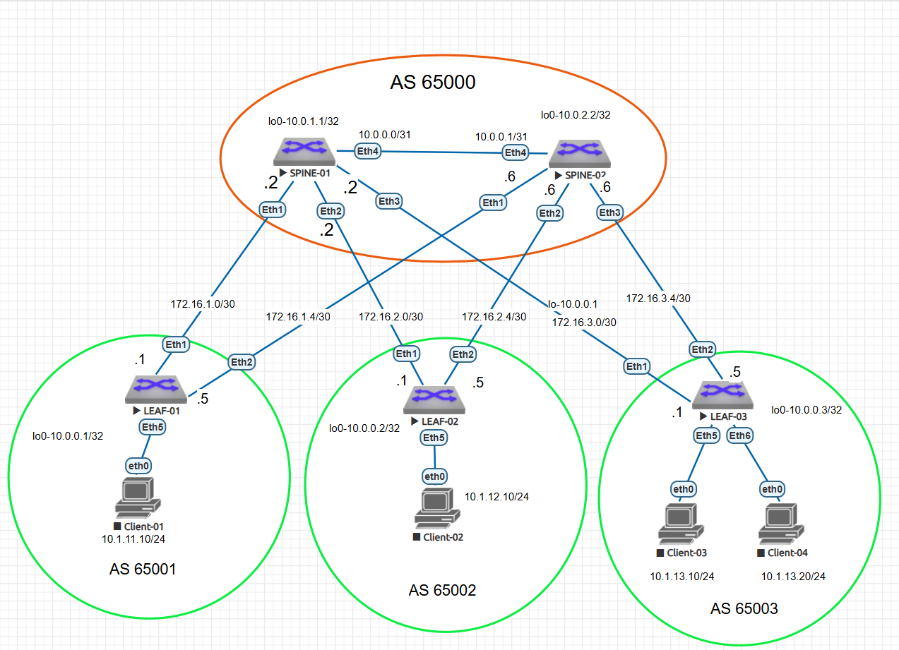

### Underlay.BGP

Цель:
 - Настроbnm BGP в Underlay сети, для IP связанности между всеми сетевыми устройствами.
 - Зафиксировать в документации - план работы, адресное пространство, схему сети, конфигурацию устройств.
 - Убедиться в наличии IP связанности между устройствами в BGP домене

В этой самостоятельной работе:

- был настроен eBGP в Underlay сети для IP связанности между всеми сетевыми устройствами.
- выделено адресное пространство
- подготовлена схема сети 
- сконфигурированы 2 spine, 3 leaf коммутатора 
- проверена ip связность между всеми устройствами в BGP-домене


### Схема 



Была выбрана следующая адресация: 

loopback-адреса 

Spine-01 10.0.1.1/32
Spine-02 10.0.2.2/32
Leaf-01 10.0.0.1/32
Leaf-02 10.0.0.2/32
Leaf-03 10.0.0.3/32

Топология p2p связей. В этой работе использовала /30 адреса для более легкого траблшутинга.

 ###Связи между SPINE-01 и LEAF-коммутаторами

 
 SPINE-01 ↔ LEAF-01
 Сеть: 172.16.1.0/30
 SPINE-01 (интерфейс Eth1): 172.16.1.2
 LEAF-01 (интерфейс Eth1): 172.16.1.1

 
 SPINE-01 ↔ LEAF-02
 Сеть: 172.16.2.0/30
 SPINE-01 (интерфейс Eth2): 172.16.2.2
 LEAF-02 (интерфейс Eth1): 172.16.2.1

 
 SPINE-01 ↔ LEAF-03
 Сеть: 172.16.3.0/30
 SPINE-01 (интерфейс Eth3): 172.16.3.2
 LEAF-03 (интерфейс Eth1): 172.16.3.1
 
 
 ###Связи между SPINE-02 и LEAF-коммутаторами
 SPINE-02 ↔ LEAF-01
 Сеть: 172.16.1.4/30
 SPINE-02 (интерфейс Eth1): 172.16.1.6
 LEAF-01 (интерфейс Eth2): 172.16.1.5

 
 SPINE-02 ↔ LEAF-02
 Сеть: 172.16.2.4/30
 SPINE-02 (интерфейс Eth2): 172.16.2.6
 LEAF-02 (интерфейс Eth2): 172.16.2.5

 
 SPINE-02 ↔ LEAF-03
 Сеть: 172.16.3.4/30
 SPINE-02 (интерфейс Eth3): 172.16.3.6
 LEAF-03 (интерфейс Eth2): 172.16.3.5


|Устройство|Интерфейс|IP-адрес и Маска|Тип подключения|Назначение 
|---|---|---|---|---|
SPINE-01|lo0|10.0.1.1/32|Loopback Локальный Router ID
SPINE-01|Eth1|172.16.1.2/30|P2P Линк|LEAF-01 (Eth1)
SPINE-01|Eth2|172.16.2.2/30|P2P Линк|LEAF-02 (Eth1)
SPINE-01|Eth3|172.16.3.2/30|P2P Линк|LEAF-03 (Eth1)|
SPINE-02|lo0|10.0.2.2/32|Loopback Локальный Router ID|
SPINE-02|Eth1|172.16.1.6/30|P2P Линк|LEAF-01 (Eth2)
SPINE-02|Eth2|172.16.2.6/30|P2P Линк|LEAF-02 (Eth2)|
SPINE-02|Eth3|172.16.3.6/30|P2P Линк|LEAF-03 (Eth2)
LEAF-01|lo0|10.0.0.1/32|Loopback Локальный Router ID
LEAF-01|Eth1|172.16.1.1/30|P2P Линк|SPINE-01 (Eth1)
LEAF-01|Eth2|172.16.1.5/30|P2P Линк|SPINE-02 (Eth1)
LEAF-02|lo0|10.0.0.2/32|Loopback Локальный Router ID
LEAF-02|Eth1|172.16.2.1/30|P2P Линк|SPINE-01 (Eth2)
LEAF-02|Eth2|172.16.2.5/30|P2P Линк|SPINE-02 (Eth2)
LEAF-03|lo0|10.0.0.3/32|Loopback Локальный Router ID
LEAF-03|Eth1|172.16.3.1/30|P2P Линк|SPINE-01 (Eth3)
LEAF-03|Eth2|172.16.3.5/30|P2P Линк|SPINE-02 (Eth3)


### Конфигурация BGP 

Был выбран eBGP, а не iBGP для простоты управления маршрутами: 
- не нужно строить full-mesh топологию и  route reflector-ы
- Используется стандартный механизм AS-Path для предотвращения петель.
Как только Leaf-01 видит свой номер AS в анонсе, он просто отбрасывает этот маршрут 

Также при использовании разных AS для каждого Leaf любые изменения, падения линков или сбои локализованы внутри конкретной автономной системы. Сбой на Leaf-01 не вызовет пересчета всей топологии iBGP/IGP на противоположной стороне фабрики.


Spine-коммутаторы находятся в одной автономной системе 65000. 
Настройка: 

```
SPINE-01#
router bgp 65000
   router-id 10.0.1.1
   address-family ipv4 
   maximum-paths 4 (Включаем режим ECMP  и разрешаем устанавливать до 4 параллельных маршрутов с одинаковой стоимостью). 
   neighbor 172.16.1.1 remote-as 65001
   neighbor 172.16.2.1 remote-as 65002
   neighbor 172.16.3.1 remote-as 65003
```

```
SPINE-02#
router bgp 65000
   router-id 10.0.2.2
   address-family ipv4 
   maximum-paths 4
   neighbor 172.16.1.5 remote-as 65001
   neighbor 172.16.2.5 remote-as 65002
   neighbor 172.16.3.5 remote-as 65003
```
Проверка соседей: 

```
SPINE-01#sh ip bgp summ
BGP summary information for VRF default
Router identifier 10.0.1.1, local AS number 65000
Neighbor Status Codes: m - Under maintenance
  Neighbor   V AS           MsgRcvd   MsgSent  InQ OutQ  Up/Down State   PfxRcd PfxAcc
  172.16.1.1 4 65001           1620      1628    0    0 04:55:26 Estab   1      1
  172.16.2.1 4 65002           1627      1620    0    0 04:54:29 Estab   1      1
  172.16.3.1 4 65003           1628      1625    0    0 04:55:16 Estab   0      0
SPINE-01#
```

```
SPINE-02#sh ip bgp summ
BGP summary information for VRF default
Router identifier 10.0.2.2, local AS number 65000
Neighbor Status Codes: m - Under maintenance
  Neighbor   V AS           MsgRcvd   MsgSent  InQ OutQ  Up/Down State   PfxRcd PfxAcc
  172.16.1.5 4 65001           1612      1608    0    0 04:53:46 Estab   1      1
  172.16.2.5 4 65002           1613      1609    0    0 04:53:12 Estab   1      1
  172.16.3.5 4 65003           1614      1611    0    0 04:53:46 Estab   0      0
SPINE-02#
```


Конфигурация на leaf-02: 
Cеть на loopback анонсировала через редистрибуцию и route-map. 
Использовала set origin incomplete, потому что на arista он сам не применяется. 
Включила community

```
!
route-map RM_red_conn permit 10
   match interface Loopback0
   set community 65001:100 65002:200 additive
   set origin incomplete
!
router bgp 65002
   router-id 10.0.0.2
   address-family ipv4
   maximum-paths 4
   neighbor 172.16.2.2 remote-as 65000
   neighbor 172.16.2.2 send-community standard extended
   neighbor 172.16.2.6 send-community standard extended
   redistribute connected route-map RM_red_conn
```


router bgp 65001
   router-id 10.0.0.1
   maximum-paths 4
   neighbor 172.16.1.2 remote-as 65000
   neighbor 172.16.1.2 send-community standard extended
   neighbor 172.16.1.6 remote-as 65000
   neighbor 172.16.1.6 send-community standard extended
   network 10.0.0.1/32
```

Community c leaf-02 видно на spine:
```
SPINE-01#
SPINE-01#
SPINE-01#sh ip bgp 10.0.0.2/32 
BGP routing table information for VRF default
Router identifier 10.0.1.1, local AS number 65000
BGP routing table entry for 10.0.0.2/32
 Paths: 1 available
  65002
    172.16.2.1 from 172.16.2.1 (10.0.0.2)
      Origin INCOMPLETE, metric 0, localpref 100, IGP metric 0, weight 0, tag 0
      Received 00:09:03 ago, valid, external, best
      Community: 65001:100 65002:200
      Rx SAFI: Unicast
```
```
SPINE-02#sh ip bgp 10.0.0.2/32 
BGP routing table information for VRF default
Router identifier 10.0.2.2, local AS number 65000
BGP routing table entry for 10.0.0.2/32
 Paths: 1 available
  65002
    172.16.2.5 from 172.16.2.5 (10.0.0.2)
      Origin INCOMPLETE, metric 0, localpref 100, IGP metric 0, weight 0, tag 0
      Received 00:10:44 ago, valid, external, best
      Community: 65001:100 65002:200
      Rx SAFI: Unicast
SPINE-02#
```

Создала community list и поменяла значение local pref для управления входящим трафиком:


```
route-map RM_CL_65002 permit 10
   match community CL_65002
   set local-preference 10
!
route-map RM_CL_65002 permit 20
!
router bgp 65003
   router-id 10.0.0.3
   maximum-paths 4
   neighbor 172.16.3.2 remote-as 65000
   neighbor 172.16.3.2 route-map RM_CL_65002 in
   neighbor 172.16.3.2 send-community standard extended
   neighbor 172.16.3.6 remote-as 65000
   neighbor 172.16.3.6 send-community standard extended
   network 10.0.0.3/32
!
end
```

Теперь  префикс со spine-01 с local pref всего 10:
```
LEAF-03#sh ip bgp 10.0.0.2/32
BGP routing table information for VRF default
Router identifier 10.0.0.3, local AS number 65003
BGP routing table entry for 10.0.0.2/32
 Paths: 2 available
  65000 65002
    172.16.3.6 from 172.16.3.6 (10.0.2.2)
      Origin INCOMPLETE, metric 0, localpref 100, IGP metric 0, weight 0, tag 0
      Received 00:10:44 ago, valid, external, best
      Rx SAFI: Unicast
  65000 65002
    172.16.3.2 from 172.16.3.2 (10.0.1.1)
      Origin INCOMPLETE, metric 0, localpref 10, IGP metric 0, weight 0, tag 0
      Received 00:02:34 ago, valid, external
      Community: 65001:100 65002:200
      Rx SAFI: Unicast
LEAF-03#
```

На leaf-01 leaf-03 loopback-сеть анонсирована через команду network:


```
LEAF-01#  
 router bgp 65001
   router-id 10.0.0.1
   maximum-paths 4
   neighbor 172.16.1.2 remote-as 65000
   neighbor 172.16.1.2 send-community standard extended
   neighbor 172.16.1.6 remote-as 65000
   neighbor 172.16.1.6 send-community standard extended
   network 10.0.0.1/32
```

```
LEAF-03#sh run sec bgp
logging level BGP errors
router bgp 65003
   router-id 10.0.0.3
   maximum-paths 4
   neighbor 172.16.3.2 remote-as 65000
   neighbor 172.16.3.2 send-community standard extended
   neighbor 172.16.3.6 remote-as 65000
   neighbor 172.16.3.6 send-community standard extended
   network 10.0.0.3/32
LEAF-03#

```

Проверка:

```
LEAF-01#sh ip bgp
BGP routing table information for VRF default
Router identifier 10.0.0.1, local AS number 65001
Route status codes: s - suppressed contributor, * - valid, > - active, E - ECMP head, e - ECMP
                    S - Stale, c - Contributing to ECMP, b - backup, L - labeled-unicast
                    % - Pending BGP convergence
Origin codes: i - IGP, e - EGP, ? - incomplete
RPKI Origin Validation codes: V - valid, I - invalid, U - unknown
AS Path Attributes: Or-ID - Originator ID, C-LST - Cluster List, LL Nexthop - Link Local Nexthop

          Network                Next Hop              Metric  AIGP       LocPref Weight  Path
 * >      10.0.0.1/32            -                     -       -          -       0       i
 * >Ec    10.0.0.2/32            172.16.1.2            0       -          100     0       65000 65002 ?
 *  ec    10.0.0.2/32            172.16.1.6            0       -          100     0       65000 65002 ?
 * >Ec    10.0.0.3/32            172.16.1.2            0       -          100     0       65000 65003 i
 *  ec    10.0.0.3/32            172.16.1.6            0       -          100     0       65000 65003 i
LEAF-01#
```


```
end
LEAF-02#sh ip bgp 
BGP routing table information for VRF default
Router identifier 10.0.0.2, local AS number 65002
Route status codes: s - suppressed contributor, * - valid, > - active, E - ECMP head, e - ECMP
                    S - Stale, c - Contributing to ECMP, b - backup, L - labeled-unicast
                    % - Pending BGP convergence
Origin codes: i - IGP, e - EGP, ? - incomplete
RPKI Origin Validation codes: V - valid, I - invalid, U - unknown
AS Path Attributes: Or-ID - Originator ID, C-LST - Cluster List, LL Nexthop - Link Local Nexthop

          Network                Next Hop              Metric  AIGP       LocPref Weight  Path
 * >Ec    10.0.0.1/32            172.16.2.2            0       -          100     0       65000 65001 i
 *  ec    10.0.0.1/32            172.16.2.6            0       -          100     0       65000 65001 i
 * >      10.0.0.2/32            -                     -       -          -       0       ?
 * >Ec    10.0.0.3/32            172.16.2.2            0       -          100     0       65000 65003 i
 *  ec    10.0.0.3/32            172.16.2.6            0       -          100     0       65000 65003 i
LEAF-02#

```


```
   network 10.0.0.3/32
LEAF-03#sh ip bgp
BGP routing table information for VRF default
Router identifier 10.0.0.3, local AS number 65003
Route status codes: s - suppressed contributor, * - valid, > - active, E - ECMP head, e - ECMP
                    S - Stale, c - Contributing to ECMP, b - backup, L - labeled-unicast
                    % - Pending BGP convergence
Origin codes: i - IGP, e - EGP, ? - incomplete
RPKI Origin Validation codes: V - valid, I - invalid, U - unknown
AS Path Attributes: Or-ID - Originator ID, C-LST - Cluster List, LL Nexthop - Link Local Nexthop

          Network                Next Hop              Metric  AIGP       LocPref Weight  Path
 * >Ec    10.0.0.1/32            172.16.3.2            0       -          100     0       65000 65001 i
 *  ec    10.0.0.1/32            172.16.3.6            0       -          100     0       65000 65001 i
 * >Ec    10.0.0.2/32            172.16.3.2            0       -          100     0       65000 65002 ?
 *  ec    10.0.0.2/32            172.16.3.6            0       -          100     0       65000 65002 ?
 * >      10.0.0.3/32            -                     -       -          -       0       i
LEAF-03#  

```

