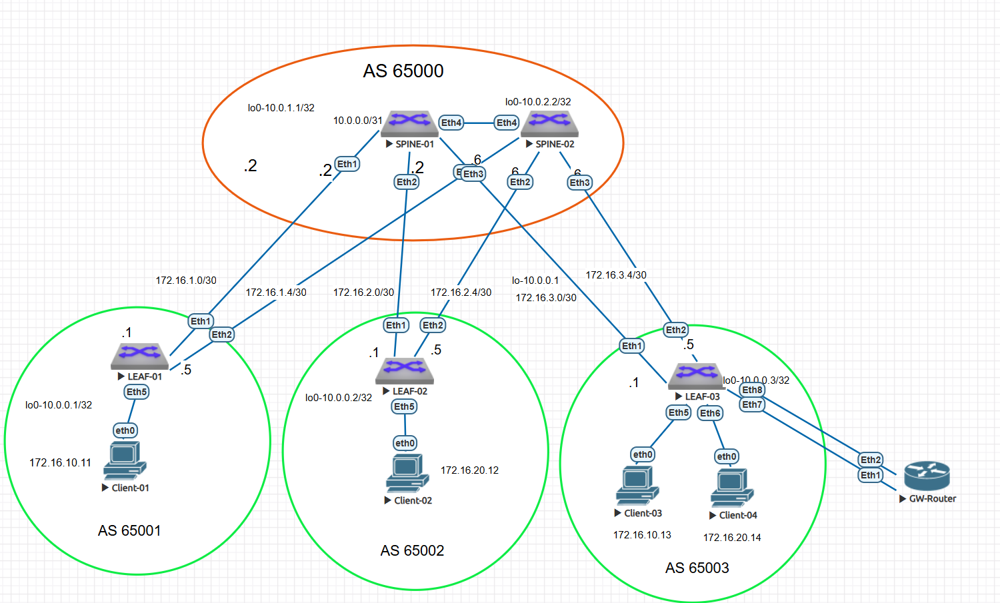

### VxLAN. L3VNI

Цель: настроить маршрутизацию в рамках Overlay между клиентами.


- Настроить каждого клиента в своем VNI
- Настроить маршрутизацию между клиентами.
- Зафиксировать в документации - план работы, адресное пространство, схему сети, конфигурацию устройств

- 
В этой самостоятельной работе:

- был настроен eBGP в Underlay сети для IP связанности между всеми сетевыми устройствами.
- выделено адресное пространство
- подготовлена схема сети 
- сконфигурированы 2 spine, 3 leaf коммутатора 
- сконфигурен  Bridged overlay - централизованный шлюз GW-router
- 


### Адресация Underlay

Была выбрана следующая адресация для Underlay: 

loopback-адреса 

Spine-01 10.0.1.1/32
Spine-02 10.0.2.2/32
Leaf-01 10.0.0.1/32
Leaf-02 10.0.0.2/32
Leaf-03 10.0.0.3/32

Топология p2p связей. В этой работе использовала /30 адреса для более легкого траблшутинга.

 ###Связи между SPINE-01 и LEAF-коммутаторами

 
 SPINE-01 ↔ LEAF-01
 Сеть: 172.16.1.0/30
 SPINE-01 (интерфейс Eth1): 172.16.1.2
 LEAF-01 (интерфейс Eth1): 172.16.1.1

 
 SPINE-01 ↔ LEAF-02
 Сеть: 172.16.2.0/30
 SPINE-01 (интерфейс Eth2): 172.16.2.2
 LEAF-02 (интерфейс Eth1): 172.16.2.1

 
 SPINE-01 ↔ LEAF-03
 Сеть: 172.16.3.0/30
 SPINE-01 (интерфейс Eth3): 172.16.3.2
 LEAF-03 (интерфейс Eth1): 172.16.3.1
 
 
 ###Связи между SPINE-02 и LEAF-коммутаторами
 SPINE-02 ↔ LEAF-01
 Сеть: 172.16.1.4/30
 SPINE-02 (интерфейс Eth1): 172.16.1.6
 LEAF-01 (интерфейс Eth2): 172.16.1.5

 
 SPINE-02 ↔ LEAF-02
 Сеть: 172.16.2.4/30
 SPINE-02 (интерфейс Eth2): 172.16.2.6
 LEAF-02 (интерфейс Eth2): 172.16.2.5

 
 SPINE-02 ↔ LEAF-03
 Сеть: 172.16.3.4/30
 SPINE-02 (интерфейс Eth3): 172.16.3.6
 LEAF-03 (интерфейс Eth2): 172.16.3.5


|Устройство|Интерфейс|IP-адрес и Маска|Тип подключения|Назначение 
|---|---|---|---|---|
SPINE-01|lo0|10.0.1.1/32|Loopback Локальный Router ID
SPINE-01|Eth1|172.16.1.2/30|P2P Линк|LEAF-01 (Eth1)
SPINE-01|Eth2|172.16.2.2/30|P2P Линк|LEAF-02 (Eth1)
SPINE-01|Eth3|172.16.3.2/30|P2P Линк|LEAF-03 (Eth1)|
SPINE-02|lo0|10.0.2.2/32|Loopback Локальный Router ID|
SPINE-02|Eth1|172.16.1.6/30|P2P Линк|LEAF-01 (Eth2)
SPINE-02|Eth2|172.16.2.6/30|P2P Линк|LEAF-02 (Eth2)|
SPINE-02|Eth3|172.16.3.6/30|P2P Линк|LEAF-03 (Eth2)
LEAF-01|lo0|10.0.0.1/32|Loopback Локальный Router ID
LEAF-01|Eth1|172.16.1.1/30|P2P Линк|SPINE-01 (Eth1)
LEAF-01|Eth2|172.16.1.5/30|P2P Линк|SPINE-02 (Eth1)
LEAF-02|lo0|10.0.0.2/32|Loopback Локальный Router ID
LEAF-02|Eth1|172.16.2.1/30|P2P Линк|SPINE-01 (Eth2)
LEAF-02|Eth2|172.16.2.5/30|P2P Линк|SPINE-02 (Eth2)
LEAF-03|lo0|10.0.0.3/32|Loopback Локальный Router ID
LEAF-03|Eth1|172.16.3.1/30|P2P Линк|SPINE-01 (Eth3)
LEAF-03|Eth2|172.16.3.5/30|P2P Линк|SPINE-02 (Eth3)


### Tаблица параметров Overlay (EVPN / VXLAN)


### Таблица адресации Overlay-сети (Этап 0. Централизованный шлюз)

| Имя узла | Интерфейс | Назначение / Роль | IP-адрес / Маска | VLAN / VNI |
| :--- | :--- | :--- | :--- | :--- |
| **GW-Router** | Ethernet1 | Шлюз по умолчанию (VLAN 10) | `172.16.10.1/24` | VLAN 10 |
| **GW-Router** | Ethernet2 | Шлюз по умолчанию (VLAN 20) | `172.16.20.1/24` | VLAN 20 |
| **Client-01** | eth0 | Конечный хост (за LEAF-01) | `172.16.10.11/24` | VLAN 10 / VNI 10010 |
| **Client-02** | eth0 | Конечный хост (за LEAF-02) | `172.16.20.12/24` | VLAN 20 / VNI 10020 |
| **Client-03** | eth0 | Конечный хост (за LEAF-03) | `172.16.10.13/24` | VLAN 10 / VNI 10010 |
| **Client-04** | eth0 | Конечный хост (за LEAF-03) | `172.16.20.14/24` | VLAN 20 / VNI 10020 |


### Bridged Overlay 

### Схема



### Настройка оборудования 

(оба spine были уже настроены для связности vxlan evpn L2) 

Spine-01: 
```
SPINE-01#sh run
! Command: show running-config
! device: SPINE-01 (vEOS-lab, EOS-4.29.2F)
!
! boot system flash:/vEOS-lab.swi
!
no aaa root
!
transceiver qsfp default-mode 4x10G
!
service routing protocols model multi-agent
!
hostname SPINE-01
!
spanning-tree mode mstp
!
interface Ethernet1
   description to-Leaf-01-eth1
   mtu 9000
   no switchport
   ip address 172.16.1.2/30
   no ip ospf neighbor bfd
!
interface Ethernet2
   description to-Leaf-02-Eth1
   mtu 9000
   no switchport
   ip address 172.16.2.2/30
   no ip ospf neighbor bfd
!
interface Ethernet3
   description to-Leaf-03-Eth1
   mtu 9000
   no switchport
   ip address 172.16.3.2/30
   no ip ospf neighbor bfd
!
interface Ethernet4
   
   shutdown
   mtu 9214
   no switchport
!
interface Ethernet5
!
interface Ethernet6
!
interface Ethernet7
!
interface Ethernet8
!
interface Loopback0
   ip address 10.0.1.1/32
!
interface Management1
!
ip routing
!
ip route 8.8.8.0/24 Null0
!
router bgp 65000
   router-id 10.0.1.1
   no bgp default ipv4-unicast
   maximum-paths 4 ecmp 4
   neighbor EVPN-OVERLAY peer group
   neighbor EVPN-OVERLAY update-source Loopback0
   neighbor EVPN-OVERLAY ebgp-multihop 3
   neighbor EVPN-OVERLAY send-community extended
   neighbor 10.0.0.1 peer group EVPN-OVERLAY
   neighbor 10.0.0.1 remote-as 65001
   neighbor 10.0.0.1 description to-LEAF-01-EVPN
   neighbor 10.0.0.2 peer group EVPN-OVERLAY
   neighbor 10.0.0.2 remote-as 65002
   neighbor 10.0.0.2 description to-LEAF-02-EVPN
   neighbor 10.0.0.3 peer group EVPN-OVERLAY
   neighbor 10.0.0.3 remote-as 65003
   neighbor 10.0.0.3 description to-LEAF-03-EVPN
   neighbor 172.16.1.1 remote-as 65001
   neighbor 172.16.1.1 description to-LEAF-01-UNDERLAY
   neighbor 172.16.2.1 remote-as 65002
   neighbor 172.16.2.1 description to-LEAF-02-UNDERLAY
   neighbor 172.16.3.1 remote-as 65003
   neighbor 172.16.3.1 description to-LEAF-03-UNDERLAY
   !
   address-family evpn
      neighbor EVPN-OVERLAY activate
   !
   address-family ipv4
      neighbor 172.16.1.1 activate
      neighbor 172.16.2.1 activate
      neighbor 172.16.3.1 activate
      network 10.0.1.1/32
!
end
SPINE-01#
```

Настройки Spine-02

```
SPINE-02#sh run
! Command: show running-config
! device: SPINE-02 (vEOS-lab, EOS-4.29.2F)
!
! boot system flash:/vEOS-lab.swi
!
no aaa root
!
transceiver qsfp default-mode 4x10G
!
service routing protocols model multi-agent
!
no logging console
!
hostname SPINE-02
!
spanning-tree mode mstp
!
interface Ethernet1
   description to-Leaf01-eth2
   mtu 9000
   no switchport
   ip address 172.16.1.6/30
!
interface Ethernet2
   description to-Leaf-02-Eth2
   mtu 9000
   no switchport
   ip address 172.16.2.6/30
!
interface Ethernet3
   description to-Leaf-03-Eth2
   mtu 9000
   no switchport
   ip address 172.16.3.6/30
!
interface Ethernet4
   description UNUSED_INTERCONNECT_TO_SPINE-01
   shutdown
   mtu 9214
   no switchport
!
interface Ethernet5
!
interface Ethernet6
!
interface Ethernet7
!
interface Ethernet8
!
interface Loopback0
   ip address 10.0.2.2/32
!
interface Management1
!
ip routing
!
router bgp 65000
   router-id 10.0.2.2
   no bgp default ipv4-unicast
   maximum-paths 4 ecmp 4
   neighbor EVPN-OVERLAY peer group
   neighbor EVPN-OVERLAY update-source Loopback0
   neighbor EVPN-OVERLAY ebgp-multihop 3
   neighbor EVPN-OVERLAY send-community extended
   neighbor 10.0.0.1 peer group EVPN-OVERLAY
   neighbor 10.0.0.1 remote-as 65001
   neighbor 10.0.0.1 description to-LEAF-01-EVPN
   neighbor 10.0.0.2 peer group EVPN-OVERLAY
   neighbor 10.0.0.2 remote-as 65002
   neighbor 10.0.0.2 description to-LEAF-02-EVPN
   neighbor 10.0.0.3 peer group EVPN-OVERLAY
   neighbor 10.0.0.3 remote-as 65003
   neighbor 10.0.0.3 description to-LEAF-03-EVPN
   neighbor 172.16.1.5 remote-as 65001
   neighbor 172.16.1.5 description to-LEAF-01-UNDERLAY
   neighbor 172.16.2.5 remote-as 65002
   neighbor 172.16.2.5 description to-LEAF-02-UNDERLAY
   neighbor 172.16.3.5 remote-as 65003
   neighbor 172.16.3.5 description to-LEAF-03-UNDERLAY
   !
   address-family evpn
      neighbor EVPN-OVERLAY activate
   !
   address-family ipv4
      neighbor 172.16.1.5 activate
      neighbor 172.16.2.5 activate
      neighbor 172.16.3.5 activate
      network 10.0.2.2/32
!
end
```

Настройки leaf-01

```
!
hostname LEAF-01
!
spanning-tree mode mstp
!
vlan 10
   name CLIENT_NETWORK
!
interface Ethernet1
   description to-Spine-01-ETh1
   mtu 9000
   no switchport
   ip address 172.16.1.1/30
   ipv6 enable
   ipv6 address auto-config
   ipv6 nd ra rx accept default-route
   no ip ospf neighbor bfd
!
interface Ethernet2
   description to-Spine-02-ETh1
   mtu 9000
   no switchport
   ip address 172.16.1.5/30
   ipv6 enable
   ipv6 address auto-config
   ipv6 nd ra rx accept default-route
   no ip ospf neighbor bfd
!
interface Ethernet3
   speed 100g-2
   no switchport
   ipv6 enable
   ipv6 address auto-config
   ipv6 nd ra rx accept default-route
!
interface Ethernet4
   speed 100g-2
   no switchport
   ipv6 enable
   ipv6 address auto-config
   ipv6 nd ra rx accept default-route
!
interface Ethernet5
   description TO_Client-01
   speed 100g-2
   switchport access vlan 10
   switchport
   ipv6 enable
   ipv6 address auto-config
   ipv6 nd ra rx accept default-route
   spanning-tree portfast
!
interface Ethernet6
   description UNUSED_PORT
   shutdown
   speed 100g-2
   no switchport
   ipv6 enable
   ipv6 address auto-config
   ipv6 nd ra rx accept default-route
!
interface Ethernet7
   speed 100g-2
   no switchport
   ipv6 enable
   ipv6 address auto-config
   ipv6 nd ra rx accept default-route
!
interface Ethernet8
   speed 100g-2
   no switchport
   ipv6 enable
   ipv6 address auto-config
   ipv6 nd ra rx accept default-route
!
interface Loopback0
   ip address 10.0.0.1/32
!
interface Management1
   speed 10full
   ipv6 enable
   ipv6 address auto-config
   ipv6 nd ra rx accept default-route
!
interface Vxlan1
   vxlan source-interface Loopback0
   vxlan udp-port 4789
   vxlan vlan 10 vni 10010
!
ip routing
!
system control-plane
   no service-policy input copp-system-policy
!
router bgp 65001
   router-id 10.0.0.1
   no bgp default ipv4-unicast
   maximum-paths 4 ecmp 4
   neighbor EVPN-OVERLAY peer group
   neighbor SPINE-EVPN peer group
   neighbor SPINE-EVPN remote-as 65000
   neighbor SPINE-EVPN next-hop-self
   neighbor SPINE-EVPN update-source Loopback0
   neighbor SPINE-EVPN ebgp-multihop 3
   neighbor SPINE-EVPN send-community extended
   neighbor 10.0.1.1 peer group SPINE-EVPN
   neighbor 10.0.1.1 remote-as 65000
   neighbor 10.0.1.1 description to-SPINE-01-EVPN
   neighbor 10.0.2.2 peer group SPINE-EVPN
   neighbor 10.0.2.2 remote-as 65000
   neighbor 10.0.2.2 update-source Loopback0
   neighbor 10.0.2.2 description SPINE-02-EVPN
   neighbor 10.0.2.2 ebgp-multihop 2
   neighbor 172.16.1.2 remote-as 65000
   neighbor 172.16.1.2 description SPINE-01-UNDERLAY
   neighbor 172.16.1.2 send-community standard extended
   neighbor 172.16.1.6 remote-as 65000
   neighbor 172.16.1.6 description SPINE-02-UNDERLAY
   neighbor 172.16.1.6 send-community standard extended
   !
   vlan 10
      rd 10.0.0.1:10
      route-target both 65000:10010
      redistribute learned
   !
   address-family evpn
      neighbor SPINE-EVPN activate
      neighbor 10.0.1.1 activate
      neighbor 10.0.2.2 activate
   !
   address-family ipv4
      neighbor 172.16.1.2 activate
      neighbor 172.16.1.6 activate
      network 10.0.0.1/32
!
end
```

###Настройки leaf-02

```
   10 match regex ETH-4
!
hostname LEAF-02
!
spanning-tree mode mstp
!
vlan 10
   name CLIENT_NETWORK
!
interface Ethernet1
   description to-Spine-01-Eth2
   mtu 9000
   speed 400g-8
   no switchport
   ip address 172.16.2.1/30
   ipv6 enable
   ipv6 address auto-config
   ipv6 nd ra rx accept default-route
!
interface Ethernet2
   description to -Spine-02-ETh2
   mtu 9000
   no switchport
   ip address 172.16.2.5/30
   ipv6 enable
   ipv6 address auto-config
   ipv6 nd ra rx accept default-route
!
interface Ethernet3
   description TO_SPINE-02_Eth2
   mtu 9214
   no switchport
   ipv6 enable
   ipv6 address auto-config
   ipv6 nd ra rx accept default-route
!
interface Ethernet4
   speed 400g-8
   no switchport
   ipv6 enable
   ipv6 address auto-config
   ipv6 nd ra rx accept default-route
!
interface Ethernet5
   description TO_Client-02
   speed 400g-8
   switchport access vlan 10
   switchport
   ipv6 enable
   ipv6 address auto-config
   ipv6 nd ra rx accept default-route
   spanning-tree portfast
!
interface Ethernet6
   description UNUSED_PORT
   shutdown
   speed 400g-8
   no switchport
   ipv6 enable
   ipv6 address auto-config
   ipv6 nd ra rx accept default-route
!
interface Ethernet7
   speed 400g-8
   no switchport
   ipv6 enable
   ipv6 address auto-config
   ipv6 nd ra rx accept default-route
!
interface Ethernet8
   speed 400g-8
   no switchport
   ipv6 enable
   ipv6 address auto-config
   ipv6 nd ra rx accept default-route
!
interface Loopback0
   ip address 10.0.0.2/32
!
interface Management1
   ipv6 enable
   ipv6 address auto-config
   ipv6 nd ra rx accept default-route
!
interface Vlan10
   description Gateway_for_LEAF-02_Clients
   ip address 10.1.11.1/24
!
interface Vxlan1
   vxlan source-interface Loopback0
   vxlan udp-port 4789
   vxlan vlan 10 vni 10010
!
ip routing
!
system control-plane
   no service-policy input copp-system-policy
!
route-map RM_import_direct permit 10
   match interface Loopback0
!
route-map RM_red_conn permit 10
   match interface Loopback0
   set community 65001:100 65002:200 additive
   set origin incomplete
!
router bgp 65002
   router-id 10.0.0.2
   no bgp default ipv4-unicast
   maximum-paths 4 ecmp 4
   neighbor EVPN-OVERLAY peer group
   neighbor SPINE-EVPN peer group
   neighbor SPINE-EVPN remote-as 65000
   neighbor SPINE-EVPN update-source Loopback0
   neighbor SPINE-EVPN ebgp-multihop 3
   neighbor SPINE-EVPN send-community extended
   neighbor 10.0.1.1 peer group SPINE-EVPN
   neighbor 10.0.1.1 remote-as 65000
   neighbor 10.0.1.1 description to-SPINE-01-EVPN
   neighbor 10.0.2.2 peer group SPINE-EVPN
   neighbor 10.0.2.2 remote-as 65000
   neighbor 10.0.2.2 update-source Loopback0
   neighbor 10.0.2.2 description SPINE-02-EVPN
   neighbor 10.0.2.2 ebgp-multihop 2
   neighbor 172.16.2.2 remote-as 65000
   neighbor 172.16.2.2 description SPINE-01-UNDERLAY
   neighbor 172.16.2.2 send-community standard extended
   neighbor 172.16.2.6 remote-as 65000
   neighbor 172.16.2.6 description SPINE-02-UNDERLAY
   neighbor 172.16.2.6 send-community standard extended
   redistribute connected route-map RM_red_conn
   !
   vlan 10
      rd 10.0.0.2:10
      route-target both 65000:10010
      redistribute learned
   !
   address-family evpn
      neighbor SPINE-EVPN activate
      neighbor 10.0.1.1 activate
      neighbor 10.0.2.2 activate
   !
   address-family ipv4
      neighbor 172.16.2.2 activate
      neighbor 172.16.2.6 activate
      network 10.0.0.2/32
      redistribute connected route-map RM_red_conn
!
end
LEAF-02#
```


Настройки leaf-03

```
match-list input string ztpFilter
   10 match regex ETH-4
!
hostname LEAF-03
!
spanning-tree mode mstp
!
vlan 10
   name CLIENT_NETWORK
!
vlan 20
!
interface Ethernet1
   description to-Spine-01-Eth3
   mtu 9000
   no switchport
   ip address 172.16.3.1/30
   ipv6 enable
   ipv6 address auto-config
   ipv6 nd ra rx accept default-route
!
interface Ethernet2
   description to Spine-02-eTh3
   mtu 9000
   no switchport
   ip address 172.16.3.5/30
   ipv6 enable
   ipv6 address auto-config
   ipv6 nd ra rx accept default-route
   ip ospf authentication message-digest
   ip ospf message-digest-key 1 md5 7 v1srhOqHBBs=
!
interface Ethernet3
   description TO_SPINE-01_Eth3
   mtu 9214
   no switchport
   ipv6 enable
   ipv6 address auto-config
   ipv6 nd ra rx accept default-route
!
interface Ethernet4
   description TO_SPINE-02_Eth3
   mtu 9214
   no switchport
   ipv6 enable
   ipv6 address auto-config
   ipv6 nd ra rx accept default-route
!
interface Ethernet5
   description TO_Client-03
   switchport access vlan 10
   switchport
   ipv6 enable
   ipv6 address auto-config
   ipv6 nd ra rx accept default-route
   spanning-tree portfast
!
interface Ethernet6
   description TO_Client-04
   switchport access vlan 20
   switchport
   ipv6 enable
   ipv6 address auto-config
   ipv6 nd ra rx accept default-route
   spanning-tree portfast
!
interface Ethernet7
   switchport access vlan 10
   switchport
!
interface Ethernet8
   switchport access vlan 20
   switchport
!
interface Loopback0
   description VTEP_IP
   ip address 10.0.0.3/32
!
interface Loopback1
!
interface Management1
   ipv6 enable
   ipv6 address auto-config
   ipv6 nd ra rx accept default-route
!
interface Vxlan1
   vxlan source-interface Loopback0
   vxlan udp-port 4789
   vxlan vlan 10 vni 10010
   vxlan vlan 20 vni 10020
!
ip routing
!
ip community-list CL_65002 permit 65002:200
!
system control-plane
   no service-policy input copp-system-policy
!
route-map RM_CL_65002 permit 10
   match community CL_65002
   set local-preference 10
!
router bgp 65003
   router-id 10.0.0.3
   no bgp default ipv4-unicast
   maximum-paths 4 ecmp 4
   neighbor EVPN-OVERLAY peer group
   neighbor SPINE-EVPN peer group
   neighbor SPINE-EVPN remote-as 65000
   neighbor SPINE-EVPN update-source Loopback0
   neighbor SPINE-EVPN ebgp-multihop 3
   neighbor SPINE-EVPN send-community extended
   neighbor 10.0.1.1 peer group SPINE-EVPN
   neighbor 10.0.1.1 remote-as 65000
   neighbor 10.0.1.1 description to-SPINE-01-EVPN
   neighbor 10.0.2.2 peer group SPINE-EVPN
   neighbor 10.0.2.2 remote-as 65000
   neighbor 10.0.2.2 update-source Loopback0
   neighbor 10.0.2.2 description SPINE-02-EVPN
   neighbor 10.0.2.2 ebgp-multihop 2
   neighbor 172.16.3.2 remote-as 65000
   neighbor 172.16.3.2 description SPINE-01-UNDERLAY
   neighbor 172.16.3.2 send-community standard extended
   neighbor 172.16.3.6 remote-as 65000
   neighbor 172.16.3.6 description SPINE-02-UNDERLAY
   neighbor 172.16.3.6 send-community standard extended
   !
   vlan 10
      rd 10.0.0.3:10010
      route-target both 65000:10010
      redistribute learned
   !
   vlan 20
      rd 10.0.0.3:10020
      route-target both 65000:10020
   !
   address-family evpn
      neighbor SPINE-EVPN activate
      neighbor 10.0.1.1 activate
      neighbor 10.0.2.2 activate
   !
   address-family ipv4
      neighbor 172.16.3.2 activate
      neighbor 172.16.3.6 activate
      network 10.0.0.3/32
!
end
LEAF-03#


```

###Настройка хостов

Client-01: 
```
VPCS> ip 172.16.10.11 172.16.10.1 24
VPCS> save

```


Client-02:
```
VPCS> ip 172.16.20.12 172.16.20.1 24
VPCS> save
```

Client -03: 
```
VPCS> ip 172.16.10.13 172.16.10.1 24
VPCS> save

```


Client -04: 
```
VPCS> ip 172.16.20.14 172.16.20.1 24
VPCS> save

```

### Настройка GW Router 

На интерфейсах были подняты IP-адреса, выступающие в роли Default Gateway для клиентов

```
GW-Router#
GW-Router#sh run
! Command: show running-config
! device: GW-Router (vEOS-lab, EOS-4.29.2F)
!
! boot system flash:/vEOS-lab.swi
!
no aaa root
!
transceiver qsfp default-mode 4x10G
!
service routing protocols model ribd
!
hostname GW-Router
!
spanning-tree mode mstp
!
interface Ethernet1
   no switchport
   ip address 172.16.10.1/24
!
interface Ethernet2
   description VLAN20_Gateway
   no switchport
   ip address 172.16.20.1/24
```

### Проверка связности 

Проверка связности с Client-1: 

```
VPCS> ping 172.16.101.1

*172.16.10.1 icmp_seq=1 ttl=64 time=89.150 ms (ICMP type:3, code:0, Destination network unreachable)
*172.16.10.1 icmp_seq=2 ttl=64 time=40.445 ms (ICMP type:3, code:0, Destination network unreachable)
*172.16.10.1 icmp_seq=3 ttl=64 time=40.249 ms (ICMP type:3, code:0, Destination network unreachable)
*172.16.10.1 icmp_seq=4 ttl=64 time=42.404 ms (ICMP type:3, code:0, Destination network unreachable)
*172.16.10.1 icmp_seq=5 ttl=64 time=97.321 ms (ICMP type:3, code:0, Destination network unreachable)

VPCS> ping 172.16.10.1 

84 bytes from 172.16.10.1 icmp_seq=1 ttl=64 time=40.423 ms
84 bytes from 172.16.10.1 icmp_seq=2 ttl=64 time=46.013 ms
84 bytes from 172.16.10.1 icmp_seq=3 ttl=64 time=42.131 ms
84 bytes from 172.16.10.1 icmp_seq=4 ttl=64 time=38.313 ms
84 bytes from 172.16.10.1 icmp_seq=5 ttl=64 time=36.527 ms

VPCS> ping 172.16.20.1

84 bytes from 172.16.20.1 icmp_seq=1 ttl=64 time=42.500 ms
84 bytes from 172.16.20.1 icmp_seq=2 ttl=64 time=38.656 ms
84 bytes from 172.16.20.1 icmp_seq=3 ttl=64 time=36.485 ms
84 bytes from 172.16.20.1 icmp_seq=4 ttl=64 time=114.160 ms
84 bytes from 172.16.20.1 icmp_seq=5 ttl=64 time=43.539 ms


VPCS> ping 172.16.20.14

84 bytes from 172.16.20.14 icmp_seq=1 ttl=63 time=82.170 ms
84 bytes from 172.16.20.14 icmp_seq=2 ttl=63 time=51.603 ms
84 bytes from 172.16.20.14 icmp_seq=3 ttl=63 time=53.052 ms
84 bytes from 172.16.20.14 icmp_seq=4 ttl=63 time=59.855 ms
84 bytes from 172.16.20.14 icmp_seq=5 ttl=63 time=49.984 ms


### Symmetric IRB

Был настроен symmetric IRB по схеме:


### конфигурация Leaf1, 2, 3

```

LEAF-01#sh run
! Command: show running-config

match-list input string ztpFilter
   10 match regex ETH-4
!
hostname LEAF-01
!
spanning-tree mode mstp
!
vlan 10
   name CLIENT_NETWORK
!
vrf instance TENANT
!
interface Ethernet1
   description to-Spine-01-ETh1
   mtu 9000
   no switchport
   ip address 172.16.1.1/30
   ipv6 enable
   ipv6 address auto-config
   ipv6 nd ra rx accept default-route
   no ip ospf neighbor bfd
!
interface Ethernet2
   description to-Spine-02-ETh1
   mtu 9000
   no switchport
   ip address 172.16.1.5/30
   ipv6 enable
   ipv6 address auto-config
   ipv6 nd ra rx accept default-route
   no ip ospf neighbor bfd
!
interface Ethernet3
   speed 100g-2
   no switchport
   ipv6 enable
   ipv6 address auto-config
   ipv6 nd ra rx accept default-route
!
interface Ethernet4
   speed 100g-2
   no switchport
   ipv6 enable
   ipv6 address auto-config
   ipv6 nd ra rx accept default-route
!
interface Ethernet5
   description TO_Client-01
   speed 100g-2
   switchport access vlan 10
   switchport
   ipv6 enable
   ipv6 address auto-config
   ipv6 nd ra rx accept default-route
   spanning-tree portfast
!
interface Ethernet6
   description UNUSED_PORT
   shutdown
   speed 100g-2
   no switchport
   ipv6 enable
   ipv6 address auto-config
   ipv6 nd ra rx accept default-route
!
interface Ethernet7
   speed 100g-2
   no switchport
   ipv6 enable
   ipv6 address auto-config
   ipv6 nd ra rx accept default-route
!
interface Ethernet8
   speed 100g-2
   no switchport
   ipv6 enable
   ipv6 address auto-config
   ipv6 nd ra rx accept default-route
!
interface Loopback0
   ip address 10.0.0.1/32
!
interface Management1
   speed 10full
   ipv6 enable
   ipv6 address auto-config
   ipv6 nd ra rx accept default-route
!
interface Vlan10
   description CLIENT_VLAN10_ANYCAST_GW
   vrf TENANT
   ip address virtual 172.16.10.1/24
!
interface Vxlan1
   vxlan source-interface Loopback0
   vxlan udp-port 4789
   vxlan vlan 10 vni 10010
   vxlan vrf TENANT vni 10000
!
ip virtual-router mac-address 00:1c:73:00:00:01
!
ip routing
ip routing vrf TENANT
!
system control-plane
   no service-policy input copp-system-policy
!
router bgp 65001
   router-id 10.0.0.1
   no bgp default ipv4-unicast
   maximum-paths 4 ecmp 4
   neighbor EVPN-OVERLAY peer group
   neighbor SPINE-EVPN peer group
   neighbor SPINE-EVPN remote-as 65000
   neighbor SPINE-EVPN next-hop-self
   neighbor SPINE-EVPN update-source Loopback0
   neighbor SPINE-EVPN ebgp-multihop 3
   neighbor SPINE-EVPN send-community extended
   neighbor 10.0.1.1 peer group SPINE-EVPN
   neighbor 10.0.1.1 remote-as 65000
   neighbor 10.0.1.1 description to-SPINE-01-EVPN
   neighbor 10.0.2.2 peer group SPINE-EVPN
   neighbor 10.0.2.2 remote-as 65000
   neighbor 10.0.2.2 update-source Loopback0
   neighbor 10.0.2.2 description SPINE-02-EVPN
   neighbor 10.0.2.2 ebgp-multihop 2
   neighbor 172.16.1.2 remote-as 65000
   neighbor 172.16.1.2 description SPINE-01-UNDERLAY
   neighbor 172.16.1.2 send-community standard extended
   neighbor 172.16.1.6 remote-as 65000
   neighbor 172.16.1.6 description SPINE-02-UNDERLAY
   neighbor 172.16.1.6 send-community standard extended
   !
   vlan 10
      rd 10.0.0.1:10
      route-target both 65000:10010
      redistribute learned
   !
   address-family evpn
      neighbor SPINE-EVPN activate
      neighbor 10.0.1.1 activate
      neighbor 10.0.2.2 activate
   !
   address-family ipv4
      neighbor 172.16.1.2 activate
      neighbor 172.16.1.6 activate
      network 10.0.0.1/32
   !
   vrf TENANT
      route-target import evpn 10000:10000
      route-target export evpn 10000:10000
      redistribute connected
!
end
LEAF-01#

```

```
LEAF-02#sh run

match-list input string ztpFilter
   10 match regex ETH-4
!
hostname LEAF-02
!
spanning-tree mode mstp
!
vlan 10
   name CLIENT_NETWORK
!
vlan 20
   name CLIENT_NETWORK_VLAN20
!
vrf instance TENANT
!
interface Ethernet1
   description to-Spine-01-Eth2
   mtu 9000
   speed 400g-8
   no switchport
   ip address 172.16.2.1/30
   ipv6 enable
   ipv6 address auto-config
   ipv6 nd ra rx accept default-route
!
interface Ethernet2
   description to -Spine-02-ETh2
   mtu 9000
   no switchport
   ip address 172.16.2.5/30
   ipv6 enable
   ipv6 address auto-config
   ipv6 nd ra rx accept default-route
!
interface Ethernet3
   description TO_SPINE-02_Eth2
   mtu 9214
   no switchport
   ipv6 enable
   ipv6 address auto-config
   ipv6 nd ra rx accept default-route
!
interface Ethernet4
   speed 400g-8
   no switchport
   ipv6 enable
   ipv6 address auto-config
   ipv6 nd ra rx accept default-route
!
interface Ethernet5
   description TO_Client-02
   speed 400g-8
   switchport access vlan 20
   switchport
   ipv6 enable
   ipv6 address auto-config
   ipv6 nd ra rx accept default-route
   spanning-tree portfast
!
interface Ethernet6
   description UNUSED_PORT
   shutdown
   speed 400g-8
   no switchport
   ipv6 enable
   ipv6 address auto-config
   ipv6 nd ra rx accept default-route
!
interface Ethernet7
   speed 400g-8
   no switchport
   ipv6 enable
   ipv6 address auto-config
   ipv6 nd ra rx accept default-route
!
interface Ethernet8
   speed 400g-8
   no switchport
   ipv6 enable
   ipv6 address auto-config
   ipv6 nd ra rx accept default-route
!
interface Loopback0
   ip address 10.0.0.2/32
!
interface Management1
   ipv6 enable
   ipv6 address auto-config
   ipv6 nd ra rx accept default-route
!
interface Vlan10
   description Gateway_for_LEAF-02_Clients
   ip address 10.1.11.1/24
!
interface Vlan20
   description CLIENT_VLAN20_ANYCAST_GW
   vrf TENANT
   ip address virtual 172.16.20.1/24
!
interface Vxlan1
   vxlan source-interface Loopback0
   vxlan udp-port 4789
   vxlan vlan 10 vni 10010
   vxlan vlan 20 vni 10020
   vxlan vrf TENANT vni 10000
!
ip virtual-router mac-address 00:1c:73:00:00:01
!
ip routing
ip routing vrf TENANT
!
system control-plane
   no service-policy input copp-system-policy
!
route-map RM_import_direct permit 10
   match interface Loopback0
!
route-map RM_red_conn permit 10
   match interface Loopback0
   set community 65001:100 65002:200 additive
   set origin incomplete
!
router bgp 65002
   router-id 10.0.0.2
   no bgp default ipv4-unicast
   maximum-paths 4 ecmp 4
   neighbor EVPN-OVERLAY peer group
   neighbor SPINE-EVPN peer group
   neighbor SPINE-EVPN remote-as 65000
   neighbor SPINE-EVPN update-source Loopback0
   neighbor SPINE-EVPN ebgp-multihop 3
   neighbor SPINE-EVPN send-community extended
   neighbor 10.0.1.1 peer group SPINE-EVPN
   neighbor 10.0.1.1 remote-as 65000
   neighbor 10.0.1.1 description to-SPINE-01-EVPN
   neighbor 10.0.2.2 peer group SPINE-EVPN
   neighbor 10.0.2.2 remote-as 65000
   neighbor 10.0.2.2 update-source Loopback0
   neighbor 10.0.2.2 description SPINE-02-EVPN
   neighbor 10.0.2.2 ebgp-multihop 2
   neighbor 172.16.2.2 remote-as 65000
   neighbor 172.16.2.2 description SPINE-01-UNDERLAY
   neighbor 172.16.2.2 send-community standard extended
   neighbor 172.16.2.6 remote-as 65000
   neighbor 172.16.2.6 description SPINE-02-UNDERLAY
   neighbor 172.16.2.6 send-community standard extended
   redistribute connected route-map RM_red_conn
   !
   vlan 10
      rd 10.0.0.2:10
      route-target both 65000:10010
      redistribute learned
   !
   vlan 20
      rd 10.0.0.2:20
      route-target both 65000:10020
      redistribute learned
   !
   address-family evpn
      neighbor SPINE-EVPN activate
      neighbor 10.0.1.1 activate
      neighbor 10.0.2.2 activate
   !
   address-family ipv4
      neighbor 172.16.2.2 activate
      neighbor 172.16.2.6 activate
      network 10.0.0.2/32
      redistribute connected route-map RM_red_conn
   !
   vrf TENANT
      route-target import evpn 10000:10000
      route-target export evpn 10000:10000
      redistribute connected
!
end
LEAF-02#     
```


```
--- 172.16.3.6 ping statistics ---
5 packets transmitted, 5 received, 0% packet loss, time 54ms
rtt min/avg/max/mdev = 7.475/9.012/12.133/1.636 ms, ipg/ewma 13.644/10.509 ms
LEAF-03#sh run

!
match-list input string ztpFilter
   10 match regex ETH-4
!
hostname LEAF-03
!
spanning-tree mode mstp
!
vlan 10
   name CLIENT_NETWORK
!
vlan 20
!
vrf instance TENANT
!
interface Ethernet1
   description to-Spine-01-Eth3
   mtu 9000
   no switchport
   ip address 172.16.3.1/30
   ipv6 enable
   ipv6 address auto-config
   ipv6 nd ra rx accept default-route
!
interface Ethernet2
   description to Spine-02-eTh3
   mtu 9000
   no switchport
   ip address 172.16.3.5/30
   ipv6 enable
   ipv6 address auto-config
   ipv6 nd ra rx accept default-route
   ip ospf authentication message-digest
   ip ospf message-digest-key 1 md5 7 v1srhOqHBBs=
!
interface Ethernet3
   description TO_SPINE-01_Eth3
   mtu 9214
   no switchport
   ipv6 enable
   ipv6 address auto-config
   ipv6 nd ra rx accept default-route
!
interface Ethernet4
   description TO_SPINE-02_Eth3
   mtu 9214
   no switchport
   ipv6 enable
   ipv6 address auto-config
   ipv6 nd ra rx accept default-route
!
interface Ethernet5
   description TO_Client-03
   switchport access vlan 10
   switchport
   ipv6 enable
   ipv6 address auto-config
   ipv6 nd ra rx accept default-route
   spanning-tree portfast
!
interface Ethernet6
   description TO_Client-04
   switchport access vlan 20
   switchport
   ipv6 enable
   ipv6 address auto-config
   ipv6 nd ra rx accept default-route
   spanning-tree portfast
!
interface Ethernet7
   switchport access vlan 10
   switchport
!
interface Ethernet8
   switchport access vlan 20
   switchport
!
interface Loopback0
   description VTEP_IP
   ip address 10.0.0.3/32
!
interface Loopback1
!
interface Management1
   ipv6 enable
   ipv6 address auto-config
   ipv6 nd ra rx accept default-route
!
interface Vlan10
   vrf TENANT
   ip address virtual 172.16.10.1/24
!
interface Vlan20
   vrf TENANT
   ip address virtual 172.16.20.1/24
!
interface Vxlan1
   vxlan source-interface Loopback0
   vxlan udp-port 4789
   vxlan vlan 10 vni 10010
   vxlan vlan 20 vni 10020
   vxlan vrf TENANT vni 10000
!
ip virtual-router mac-address 00:1c:73:00:00:01
!
ip routing
ip routing vrf TENANT
!
ip community-list CL_65002 permit 65002:200
!
system control-plane
   no service-policy input copp-system-policy
!
route-map RM_CL_65002 permit 10
   match community CL_65002
   set local-preference 10
!
router bgp 65003
   router-id 10.0.0.3
   no bgp default ipv4-unicast
   maximum-paths 4 ecmp 4
   neighbor EVPN-OVERLAY peer group
   neighbor SPINE-EVPN peer group
   neighbor SPINE-EVPN remote-as 65000
   neighbor SPINE-EVPN update-source Loopback0
   neighbor SPINE-EVPN ebgp-multihop 3
   neighbor SPINE-EVPN send-community extended
   neighbor 10.0.1.1 peer group SPINE-EVPN
   neighbor 10.0.1.1 remote-as 65000
   neighbor 10.0.1.1 description to-SPINE-01-EVPN
   neighbor 10.0.2.2 peer group SPINE-EVPN
   neighbor 10.0.2.2 remote-as 65000
   neighbor 10.0.2.2 update-source Loopback0
   neighbor 10.0.2.2 description SPINE-02-EVPN
   neighbor 10.0.2.2 ebgp-multihop 2
   neighbor 172.16.3.2 remote-as 65000
   neighbor 172.16.3.2 description SPINE-01-UNDERLAY
   neighbor 172.16.3.2 send-community standard extended
   neighbor 172.16.3.6 remote-as 65000
   neighbor 172.16.3.6 description SPINE-02-UNDERLAY
   neighbor 172.16.3.6 send-community standard extended
   !
   vlan 10
      rd 10.0.0.3:10010
      route-target both 65000:10010
      redistribute learned
   !
   vlan 20
      rd 10.0.0.3:10020
      route-target both 65000:10020
      redistribute learned
   !
   address-family evpn
      neighbor SPINE-EVPN activate
      neighbor 10.0.1.1 activate
      neighbor 10.0.2.2 activate
   !
   address-family ipv4
      neighbor 172.16.3.2 activate
      neighbor 172.16.3.6 activate
      network 10.0.0.3/32
   !
   vrf TENANT
      route-target import evpn 10000:10000
      route-target export evpn 10000:10000
      redistribute connected
!
end
LEAF-03#  

```


### ПРоверка с РС4:

```
VPCS> ping 172.16.10.1

84 bytes from 172.16.10.1 icmp_seq=1 ttl=64 time=87.656 ms
84 bytes from 172.16.10.1 icmp_seq=2 ttl=64 time=10.009 ms
84 bytes from 172.16.10.1 icmp_seq=3 ttl=64 time=7.324 ms
84 bytes from 172.16.10.1 icmp_seq=4 ttl=64 time=8.025 ms
84 bytes from 172.16.10.1 icmp_seq=5 ttl=64 time=7.461 ms
^[[A
VPCS> ping 172.16.10.12

host (172.16.10.12) not reachable

VPCS> ping 172.16.10.11

84 bytes from 172.16.10.11 icmp_seq=1 ttl=64 time=327.031 ms
84 bytes from 172.16.10.11 icmp_seq=2 ttl=64 time=105.145 ms
84 bytes from 172.16.10.11 icmp_seq=3 ttl=64 time=37.659 ms
84 bytes from 172.16.10.11 icmp_seq=4 ttl=64 time=39.566 ms
84 bytes from 172.16.10.11 icmp_seq=5 ttl=64 time=37.723 ms

VPCS> ping 172.16.20.1 

84 bytes from 172.16.20.1 icmp_seq=1 ttl=64 time=14.041 ms
84 bytes from 172.16.20.1 icmp_seq=2 ttl=64 time=12.625 ms
84 bytes from 172.16.20.1 icmp_seq=3 ttl=64 time=9.147 ms
84 bytes from 172.16.20.1 icmp_seq=4 ttl=64 time=7.445 ms
84 bytes from 172.16.20.1 icmp_seq=5 ttl=64 time=7.485 ms
^[[A
VPCS> ping 172.16.20.14

84 bytes from 172.16.20.14 icmp_seq=1 ttl=63 time=209.274 ms
84 bytes from 172.16.20.14 icmp_seq=2 ttl=63 time=13.627 ms
84 bytes from 172.16.20.14 icmp_seq=3 ttl=63 time=14.398 ms
84 bytes from 172.16.20.14 icmp_seq=4 ttl=63 time=16.277 ms
84 bytes from 172.16.20.14 icmp_seq=5 ttl=63 time=13.484 ms

VPCS> ping 172.16.20.12

84 bytes from 172.16.20.12 icmp_seq=1 ttl=62 time=995.329 ms
84 bytes from 172.16.20.12 icmp_seq=2 ttl=62 time=37.519 ms
84 bytes from 172.16.20.12 icmp_seq=3 ttl=62 time=55.435 ms
84 bytes from 172.16.20.12 icmp_seq=4 ttl=62 time=34.953 ms
84 bytes from 172.16.20.12 icmp_seq=5 ttl=62 time=42.694 ms

VPCS> 
```
