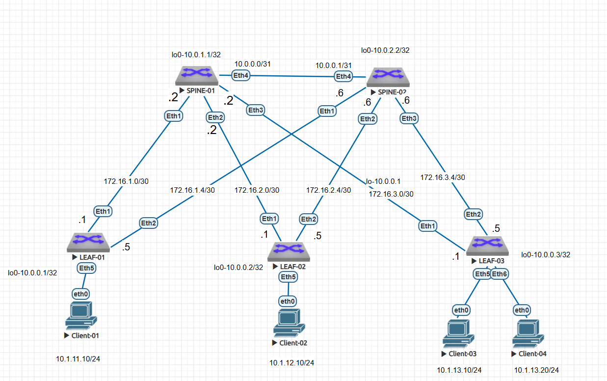

### Underlay.ISIS

Цель:
настроить ISIS для Underlay сети.

В этой самостоятельной работе:

- был настроен ISIS в Underlay сети для IP связанности между всеми сетевыми устройствами.
- выделено адресное пространство
- подготовлена схема сети 
- сконфигурированы 2 spine, 3 leaf коммутатора 
- проверена ip связность между всеми устройствами в ISIS-домене


### Схема 



Была выбрана следующая адресация: 

loopback-адреса 

Spine-01 10.0.1.1/32
Spine-02 10.0.2.2/32
Leaf-01 10.0.0.1/32
Leaf-02 10.0.0.2/32
Leaf-03 10.0.0.3/32

Топология p2p связей. В этой работе использовала /30 адреса для более легкого траблшутинга.

 ###Связи между SPINE-01 и LEAF-коммутаторами

 
 SPINE-01 ↔ LEAF-01
 Сеть: 172.16.1.0/30
 SPINE-01 (интерфейс Eth1): 172.16.1.2
 LEAF-01 (интерфейс Eth1): 172.16.1.1

 
 SPINE-01 ↔ LEAF-02
 Сеть: 172.16.2.0/30
 SPINE-01 (интерфейс Eth2): 172.16.2.2
 LEAF-02 (интерфейс Eth1): 172.16.2.1

 
 SPINE-01 ↔ LEAF-03
 Сеть: 172.16.3.0/30
 SPINE-01 (интерфейс Eth3): 172.16.3.2
 LEAF-03 (интерфейс Eth1): 172.16.3.1
 
 
 ###Связи между SPINE-02 и LEAF-коммутаторами
 SPINE-02 ↔ LEAF-01
 Сеть: 172.16.1.4/30
 SPINE-02 (интерфейс Eth1): 172.16.1.6
 LEAF-01 (интерфейс Eth2): 172.16.1.5

 
 SPINE-02 ↔ LEAF-02
 Сеть: 172.16.2.4/30
 SPINE-02 (интерфейс Eth2): 172.16.2.6
 LEAF-02 (интерфейс Eth2): 172.16.2.5

 
 SPINE-02 ↔ LEAF-03
 Сеть: 172.16.3.4/30
 SPINE-02 (интерфейс Eth3): 172.16.3.6
 LEAF-03 (интерфейс Eth2): 172.16.3.5


|Устройство|Интерфейс|IP-адрес и Маска|Тип подключения|Назначение 
|---|---|---|---|---|
SPINE-01|lo0|10.0.1.1/32|Loopback Локальный Router ID
SPINE-01|Eth1|172.16.1.2/30|P2P Линк|LEAF-01 (Eth1)
SPINE-01|Eth2|172.16.2.2/30|P2P Линк|LEAF-02 (Eth1)
SPINE-01|Eth3|172.16.3.2/30|P2P Линк|LEAF-03 (Eth1)|
SPINE-02|lo0|10.0.2.2/32|Loopback Локальный Router ID|
SPINE-02|Eth1|172.16.1.6/30|P2P Линк|LEAF-01 (Eth2)
SPINE-02|Eth2|172.16.2.6/30|P2P Линк|LEAF-02 (Eth2)|
SPINE-02|Eth3|172.16.3.6/30|P2P Линк|LEAF-03 (Eth2)
LEAF-01|lo0|10.0.0.1/32|Loopback Локальный Router ID
LEAF-01|Eth1|172.16.1.1/30|P2P Линк|SPINE-01 (Eth1)
LEAF-01|Eth2|172.16.1.5/30|P2P Линк|SPINE-02 (Eth1)
LEAF-02|lo0|10.0.0.2/32|Loopback Локальный Router ID
LEAF-02|Eth1|172.16.2.1/30|P2P Линк|SPINE-01 (Eth2)
LEAF-02|Eth2|172.16.2.5/30|P2P Линк|SPINE-02 (Eth2)
LEAF-03|lo0|10.0.0.3/32|Loopback Локальный Router ID
LEAF-03|Eth1|172.16.3.1/30|P2P Линк|SPINE-01 (Eth3)
LEAF-03|Eth2|172.16.3.5/30|P2P Линк|SPINE-02 (Eth3)


### Конфигурация ISIS 

Все коммутаторы находятся в зоне Area 0.


Настройки на коммутаторах: 

```

SPINE-01(config-router-isis-af)#net 49.0001.1111.1111.1111.00
SPINE-01(config-router-isis)#inter eth 1-3
SPINE-01(config-if-Et1-3)#no mtu 
SPINE-01(config-if-Et1-3)#mtu 9000
SPINE-01(config-if-Et1-3)#isis enable UNDERLAY
SPINE-01(config-if-Et1-3)#isis network point-to-point 
SPINE-01(config-if-Et1-3)#isis circuit-type level-1
SPINE-01(config-if-Et1-3)#inter lo 0
SPINE-01(config-if-Lo0)#isis enable UNDERLAY
```

```

SPINE-02#conf t
SPINE-02(config)#router isis UNDERLAY
SPINE-02(config-router-isis)#address-family ipv4 unicast 
SPINE-02(config-router-isis-af)#net 49.0001.2222.2222.2222.00
SPINE-02(config-router-isis)#inter eth1-3
SPINE-02(config-if-Et1-3)#no mtu
SPINE-02(config-if-Et1-3)#mtu 9000
SPINE-02(config-if-Et1-3)#isis enable UNDERLAY
SPINE-02(config-if-Et1-3)#isis network point-to-point 
SPINE-02(config-if-Et1-3)#isis circuit-type level-1
SPINE-02(config-if-Et1-3)#inter lo 0
SPINE-02(config-if-Lo0)#isis enable UNDERLAY
```

```

LEAF-01(config)#router isis UNDERLAY
LEAF-01(config-router-isis)#address-family ipv4 unicast 
LEAF-01(config-router-isis-af)#net 49.0001.0001.0001.0001.00
LEAF-01(config-router-isis)#inter eth 1-2
LEAF-01(config-if-Et1-2)#no mtu
LEAF-01(config-if-Et1-2)#mtu 9000
LEAF-01(config-if-Et1-2)#isis enable UNDERLAY
LEAF-01(config-if-Et1-2)#isis network point-to-point 
LEAF-01(config-if-Et1-2)#isis circuit-type level-1
LEAF-01(config-if-Et1-2)#inter lo 0
LEAF-01(config-if-Lo0)#isis enable UNDERLAY
```


```

LEAF-02(config)#router isis UNDERLAY
LEAF-02(config-router-isis)#address-family ipv4 uni
LEAF-02(config-router-isis-af)#net 49.0001.0002.0002.0002.00
LEAF-02(config-router-isis)#inter eth 1-2
LEAF-02(config-if-Et1-2)#no mtu
LEAF-02(config-if-Et1-2)#mtu 9000
LEAF-02(config-if-Et1-2)#isis enable UNDERLAY
LEAF-02(config-if-Et1-2)#isis network point-to-point 
LEAF-02(config-if-Et1-2)#isis circuit-type level-1
LEAF-02(config-if-Et1-2)#inter lo0
LEAF-02(config-if-Lo0)#isis enable UNDERLAY
```


```

LEAF-03(config)#router isis UNDERLAY
LEAF-03(config-router-isis)#address-family ipv4 unicast 
LEAF-03(config-router-isis-af)#net 49.0001.0003.0003.0003.00
LEAF-03(config-router-isis)#inter eth 1-2
LEAF-03(config-if-Et1-2)#no mtu
LEAF-03(config-if-Et1-2)#mtu 9000
LEAF-03(config-if-Et1-2)#isis enable UNDERLAY
LEAF-03(config-if-Et1-2)#isis network point-to-point 
LEAF-03(config-if-Et1-2)#isis circuit-type level-1
LEAF-03(config-if-Et1-2)#inter lo 0
LEAF-03(config-if-Lo0)#isis enable UNDERLAY
```


### Проверка связности 

```

SPINE-01#sh isis neighbors  
Instance  VRF      System Id        Type Interface          SNPA              State Hold time   Circuit Id          
UNDERLAY  default  LEAF-01          L1   Ethernet1          P2P               UP    29          0E                  
UNDERLAY  default  LEAF-02          L1   Ethernet2          P2P               UP    29          0E                  
UNDERLAY  default  LEAF-03          L1   Ethernet3          P2P               UP    28          0E                  
SPINE-01#sh isis database 

IS-IS Instance: UNDERLAY VRF: default
  IS-IS Level 1 Link State Database
    LSPID                   Seq Num  Cksum  Life Length IS Flags
    LEAF-01.00-00                 8  53742   813    123 L2 <>
    LEAF-02.00-00                 8  46846   954    123 L2 <>
    LEAF-03.00-00                 8  39695  1096    123 L2 <>
    SPINE-01.00-00               12   3131  1093    148 L2 <>
    SPINE-02.00-00               12  35383  1088    148 L2 <>
  IS-IS Level 2 Link State Database
    LSPID                   Seq Num  Cksum  Life Length IS Flags
    SPINE-01.00-00               14   5427  1097    166 L2 <>
```

```

SPINE-02#sh isis nei
 
Instance  VRF      System Id        Type Interface          SNPA              State Hold time   Circuit Id          
UNDERLAY  default  LEAF-01          L1   Ethernet1          P2P               UP    21          0F                  
UNDERLAY  default  LEAF-02          L1   Ethernet2          P2P               UP    21          0F                  
UNDERLAY  default  LEAF-03          L1   Ethernet3          P2P               UP    29          0F                  
SPINE-02#
SPINE-02#
SPINE-02#sh isis data

IS-IS Instance: UNDERLAY VRF: default
  IS-IS Level 1 Link State Database
    LSPID                   Seq Num  Cksum  Life Length IS Flags
    LEAF-01.00-00                16  49654   825    123 L2 <>
    LEAF-02.00-00                16  42503  1161    123 L2 <>
    LEAF-03.00-00                16  35607  1124    123 L2 <>
    SPINE-01.00-00               21  63812  1139    148 L2 <>
    SPINE-02.00-00               20  31295   535    148 L2 <>
  IS-IS Level 2 Link State Database
    LSPID                   Seq Num  Cksum  Life Length IS Flags
    SPINE-02.00-00               21  55365   693    157 L2 <>
SPINE-02#
```


```

LEAF-01(config)#sh isis data

IS-IS Instance: UNDERLAY VRF: default
  IS-IS Level 1 Link State Database
    LSPID                   Seq Num  Cksum  Life Length IS Flags
    LEAF-01.00-00                16  49654   910    123 L2 <>
    LEAF-02.00-00                15  43014   369    123 L2 <>
    LEAF-03.00-00                15  36118   358    123 L2 <>
    SPINE-01.00-00               20  64323   472    148 L2 <>
    SPINE-02.00-00               20  31295   621    148 L2 <>
  IS-IS Level 2 Link State Database
    LSPID                   Seq Num  Cksum  Life Length IS Flags
    LEAF-01.00-00                15  21421  1036    165 L2 <>
LEAF-01(config)#
LEAF-01(config)#
LEAF-01(config)#
LEAF-01(config)#
LEAF-01(config)#sh isis nei
 
Instance  VRF      System Id        Type Interface          SNPA              State Hold time   Circuit Id          
UNDERLAY  default  SPINE-01         L1   Ethernet1          P2P               UP    30          0E                  
UNDERLAY  default  SPINE-02         L1   Ethernet2          P2P               UP    30          0E                  
LEAF-01(config)#
```


```

SPINE-02#sh isis nei
 
Instance  VRF      System Id        Type Interface          SNPA              State Hold time   Circuit Id          
UNDERLAY  default  LEAF-01          L1   Ethernet1          P2P               UP    21          0F                  
UNDERLAY  default  LEAF-02          L1   Ethernet2          P2P               UP    21          0F                  
UNDERLAY  default  LEAF-03          L1   Ethernet3          P2P               UP    29          0F                  
SPINE-02#
SPINE-02#
SPINE-02#sh isis data

IS-IS Instance: UNDERLAY VRF: default
  IS-IS Level 1 Link State Database
    LSPID                   Seq Num  Cksum  Life Length IS Flags
    LEAF-01.00-00                16  49654   825    123 L2 <>
    LEAF-02.00-00                16  42503  1161    123 L2 <>
    LEAF-03.00-00                16  35607  1124    123 L2 <>
    SPINE-01.00-00               21  63812  1139    148 L2 <>
    SPINE-02.00-00               20  31295   535    148 L2 <>
  IS-IS Level 2 Link State Database
    LSPID                   Seq Num  Cksum  Life Length IS Flags
    SPINE-02.00-00               21  55365   693    157 L2 <>

  ```
  

```

LEAF-03#sh isis data

IS-IS Instance: UNDERLAY VRF: default
  IS-IS Level 1 Link State Database
    LSPID                   Seq Num  Cksum  Life Length IS Flags
    LEAF-01.00-00                 8  53742  1099    123 L2 <>
    LEAF-02.00-00                 8  46846  1099    123 L2 <>
    LEAF-03.00-00                 8  39695  1118    123 L2 <>
    SPINE-01.00-00               12   3131  1115    148 L2 <>
    SPINE-02.00-00               12  35383  1110    148 L2 <>
  IS-IS Level 2 Link State Database
    LSPID                   Seq Num  Cksum  Life Length IS Flags
    LEAF-03.00-00                 9  63745  1118    165 L2 <>


LEAF-03#sh isis nei
 
Instance  VRF      System Id        Type Interface          SNPA              State Hold time   Circuit Id          
UNDERLAY  default  SPINE-01         L1   Ethernet1          P2P               UP    28          10                  
UNDERLAY  default  SPINE-02         L1   Ethernet2          P2P               UP    25          10

```


            
c Leaf-03 есть пинг до всех loopback-адресов: 
```

LEAF-03#ping 10.0.0.1
PING 10.0.0.1 (10.0.0.1) 72(100) bytes of data.
80 bytes from 10.0.0.1: icmp_seq=1 ttl=63 time=44.7 ms
80 bytes from 10.0.0.1: icmp_seq=2 ttl=63 time=37.3 ms
80 bytes from 10.0.0.1: icmp_seq=3 ttl=63 time=30.9 ms
80 bytes from 10.0.0.1: icmp_seq=4 ttl=63 time=30.6 ms
80 bytes from 10.0.0.1: icmp_seq=5 ttl=63 time=22.5 ms

--- 10.0.0.1 ping statistics ---
5 packets transmitted, 5 received, 0% packet loss, time 86ms
rtt min/avg/max/mdev = 22.559/33.260/44.788/7.439 ms, pipe 4, ipg/ewma 21.516/38.515 ms
LEAF-03#ping 10.0.0.2
PING 10.0.0.2 (10.0.0.2) 72(100) bytes of data.
80 bytes from 10.0.0.2: icmp_seq=1 ttl=63 time=25.1 ms
80 bytes from 10.0.0.2: icmp_seq=2 ttl=63 time=24.8 ms
80 bytes from 10.0.0.2: icmp_seq=3 ttl=63 time=20.2 ms
80 bytes from 10.0.0.2: icmp_seq=4 ttl=63 time=19.9 ms
80 bytes from 10.0.0.2: icmp_seq=5 ttl=63 time=23.6 ms

--- 10.0.0.2 ping statistics ---
5 packets transmitted, 5 received, 0% packet loss, time 88ms
rtt min/avg/max/mdev = 19.926/22.772/25.153/2.249 ms, pipe 2, ipg/ewma 22.026/23.902 ms
LEAF-03#ping 10.0.1.1
PING 10.0.1.1 (10.0.1.1) 72(100) bytes of data.
80 bytes from 10.0.1.1: icmp_seq=1 ttl=64 time=14.3 ms
80 bytes from 10.0.1.1: icmp_seq=2 ttl=64 time=9.11 ms
80 bytes from 10.0.1.1: icmp_seq=3 ttl=64 time=8.39 ms
80 bytes from 10.0.1.1: icmp_seq=4 ttl=64 time=7.10 ms
80 bytes from 10.0.1.1: icmp_seq=5 ttl=64 time=7.78 ms

--- 10.0.1.1 ping statistics ---
5 packets transmitted, 5 received, 0% packet loss, time 52ms
rtt min/avg/max/mdev = 7.105/9.339/14.309/2.574 ms, pipe 2, ipg/ewma 13.209/11.703 ms
LEAF-03#ping 10.0.1.2
connect: Network is unreachable
LEAF-03#ping 10.0.2.2
PING 10.0.2.2 (10.0.2.2) 72(100) bytes of data.
80 bytes from 10.0.2.2: icmp_seq=1 ttl=64 time=13.7 ms
80 bytes from 10.0.2.2: icmp_seq=2 ttl=64 time=10.5 ms
80 bytes from 10.0.2.2: icmp_seq=3 ttl=64 time=10.0 ms
80 bytes from 10.0.2.2: icmp_seq=4 ttl=64 time=9.05 ms
80 bytes from 10.0.2.2: icmp_seq=5 ttl=64 time=11.2 ms

--- 10.0.2.2 ping statistics ---
5 packets transmitted, 5 received, 0% packet loss, time 59ms
rtt min/avg/max/mdev = 9.053/10.904/13.704/1.564 ms, ipg/ewma 14.879/12.265 ms

```


