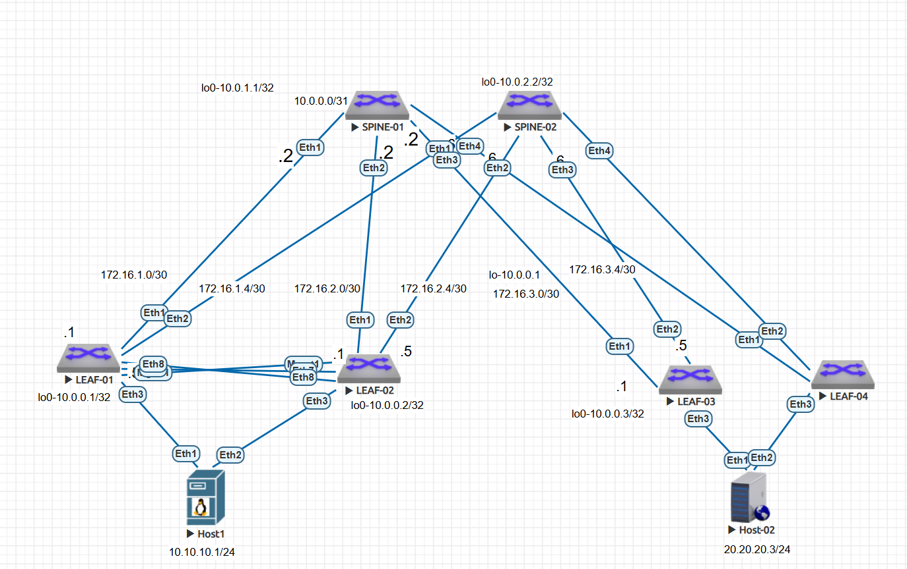

### VXLAN. Multihoming  vs M-LAG 

Цель:
настроить отказоустойчивое подключение клиентов с использованием EVPN Multihoming.


-Подключены клиенты 2-я линками к различным Leaf
-Настроен агрегированный канал со стороны клиента
-Настроен multihoming для работы в Overlay сети.
-Зафиксировано в документации - план работы, адресное пространство, схему сети, конфигурацию устройств
-протестирована отказоустойчивость. Связнность не теряется при отключении одного из линков

### Схема сети 




### Tаблица параметров Overlay (EVPN / VXLAN)


### Настройка оборудования 
### Leaf-01 

```
Leaf1#sh run
! Command: show running-config
! device: Leaf1 (vEOS-lab, EOS-4.29.2F)
!
! boot system flash:/vEOS-lab.swi
!
no aaa root
!
transceiver qsfp default-mode 4x10G
!
service routing protocols model multi-agent
!
no logging console
!
hostname Leaf1
!
spanning-tree mode mstp
no spanning-tree vlan-id 4094
!
vlan 10
   name VL10
!
vlan 4094
   name MLAG-PEERLINK
   trunk group MLAG-PEERLINK
!
vrf instance MGMT
!
vrf instance VRF1
!
interface Port-Channel3
   description ---Link-to-Server1---
   switchport mode trunk
   mlag 1
!
interface Port-Channel78
   description MLAG-PEERLINK
   switchport mode trunk
   switchport trunk group MLAG-PEERLINK
   spanning-tree link-type point-to-point
!
interface Ethernet1
   description connected-to-Spine1-Ethernet1
   mtu 9214
   no switchport
   ip address 172.16.1.1/30
!
interface Ethernet2
   description connected-to-Spine2-Ethernet1
   mtu 9214
   no switchport
   ip address 172.16.1.5/30
!
interface Ethernet3
   description ---Link-to-Server1---
   switchport mode trunk
   channel-group 3 mode active
!
interface Ethernet4
!
interface Ethernet5
!
interface Ethernet6
!
interface Ethernet7
   description MLAG-PEERLINK
   channel-group 78 mode active
!
interface Ethernet8
   description MLAG-PEERLINK
   channel-group 78 mode active
!
interface Loopback0
   ip address 10.0.0.1/32
!
interface Loopback1
   description VXLAN-VTEP
   ip address 10.0.0.112/32
!
interface Management1
   vrf MGMT
   ip address 192.168.0.1/30
!
interface Vlan10
   vrf VRF1
   ip address 10.10.10.201/24
   ip virtual-router address 10.10.10.254
!
interface Vlan4094
   ip address 172.16.101.1/30
!
interface Vxlan1
   vxlan source-interface Loopback1
   vxlan udp-port 4789
   vxlan vlan 10 vni 100010
   vxlan vrf VRF1 vni 111111
   vxlan learn-restrict any
!
ip virtual-router mac-address 02:00:00:00:00:00
!
ip routing
ip routing vrf MGMT
ip routing vrf VRF1
!
mlag configuration
   domain-id LEAVES-1-2
   local-interface Vlan4094
   peer-address 172.16.101.2
   peer-address heartbeat 192.168.0.2 vrf MGMT
   peer-link Port-Channel78
   dual-primary detection delay 1 action errdisable all-interfaces
!
router bgp 65501
   router-id 10.0.0.1
   no bgp default ipv4-unicast
   timers bgp 1 3
   distance bgp 20 200 200
   maximum-paths 2 ecmp 2
   neighbor EVPN peer group
   neighbor EVPN remote-as 65500
   neighbor EVPN update-source Loopback0
   neighbor EVPN ebgp-multihop 3
   neighbor EVPN send-community extended
   neighbor UNDERLAY peer group
   neighbor UNDERLAY remote-as 65500
   neighbor UNDERLAY-MLAG peer group
   neighbor UNDERLAY-MLAG remote-as 65501
   neighbor UNDERLAY-MLAG next-hop-self
   neighbor 10.0.1.1 peer group EVPN
   neighbor 10.0.2.2 peer group EVPN
   neighbor 172.16.1.2 peer group UNDERLAY
   neighbor 172.16.1.6 peer group UNDERLAY
   neighbor 172.16.101.2 peer group UNDERLAY-MLAG
   !
   vlan 10
      rd auto
      route-target both 10:100010
      redistribute learned
   !
   address-family evpn
      neighbor EVPN activate
   !
   address-family ipv4
      neighbor UNDERLAY activate
      neighbor UNDERLAY-MLAG activate
      network 10.0.0.1/32
      network 10.0.0.112/32
   !
   vrf VRF1
      rd 65501:1
      route-target import evpn 1:111111
      route-target export evpn 1:111111
      redistribute connected
!
end
Leaf1#
```

### LEAF-02

```

Leaf2#sh run
! Command: show running-config
! device: Leaf2 (vEOS-lab, EOS-4.29.2F)
!
! boot system flash:/vEOS-lab.swi
!
no aaa root
!
transceiver qsfp default-mode 4x10G
!
service routing protocols model multi-agent
!
no logging console
!
hostname Leaf2
!
spanning-tree mode mstp
no spanning-tree vlan-id 4094
!
vlan 10
   name VL10
!
vlan 4094
   name MLAG-PEERLINK
   trunk group MLAG-PEERLINK
!
vrf instance MGMT
!
vrf instance VRF1
!
interface Port-Channel3
   description ---Link-to-Server1---
   switchport mode trunk
   mlag 1
!
interface Port-Channel78
   description MLAG-PEERLINK
   switchport mode trunk
   switchport trunk group MLAG-PEERLINK
   spanning-tree link-type point-to-point
!
interface Ethernet1
   description connected-to-Spine1-Ethernet2
   mtu 9214
   no switchport
   ip address 172.16.2.1/30
!
interface Ethernet2
   description connected-to-Spine2-Ethernet2
   mtu 9214
   no switchport
   ip address 172.16.2.5/30
!
interface Ethernet3
   description ---Link-to-Server1---
   switchport mode trunk
   channel-group 3 mode active
!
interface Ethernet4
!
interface Ethernet5
!
interface Ethernet6
!
interface Ethernet7
   description MLAG-PEERLINK
   channel-group 78 mode active
!
interface Ethernet8
   description MLAG-PEERLINK
   channel-group 78 mode active
!
interface Loopback0
   ip address 10.0.0.2/32
!
interface Loopback1
   description VXLAN-VTEP
   ip address 10.0.0.112/32
!
interface Management1
   vrf MGMT
   ip address 192.168.0.2/30
!
interface Vlan10
   vrf VRF1
   ip address 10.10.10.202/24
   ip virtual-router address 10.10.10.254
!
interface Vlan4094
   no autostate
   ip address 172.16.101.2/30
!
interface Vxlan1
   vxlan source-interface Loopback1
   vxlan udp-port 4789
   vxlan vlan 10 vni 100010
   vxlan vrf VRF1 vni 111111
   vxlan learn-restrict any
!
ip virtual-router mac-address 02:00:00:00:00:00
!
ip routing
ip routing vrf MGMT
ip routing vrf VRF1
!
mlag configuration
   domain-id LEAVES-1-2
   local-interface Vlan4094
   peer-address 172.16.101.1
   peer-address heartbeat 192.168.0.1 vrf MGMT
   peer-link Port-Channel78
   dual-primary detection delay 1 action errdisable all-interfaces
!
router bgp 65501
   router-id 10.0.0.2
   no bgp default ipv4-unicast
   timers bgp 1 3
   distance bgp 20 200 200
   maximum-paths 2 ecmp 2
   neighbor EVPN peer group
   neighbor EVPN remote-as 65500
   neighbor EVPN update-source Loopback0
   neighbor EVPN ebgp-multihop 3
   neighbor EVPN send-community extended
   neighbor UNDERLAY peer group
   neighbor UNDERLAY remote-as 65500
   neighbor UNDERLAY-MLAG peer group
   neighbor UNDERLAY-MLAG remote-as 65501
   neighbor UNDERLAY-MLAG next-hop-self
   neighbor 10.0.1.1 peer group EVPN
   neighbor 10.0.2.2 peer group EVPN
   neighbor 172.16.2.2 peer group UNDERLAY
   neighbor 172.16.2.6 peer group UNDERLAY
   neighbor 172.16.101.1 peer group UNDERLAY-MLAG
   !
   vlan 10
      rd auto
      route-target both 10:100010
      redistribute learned
   !
   address-family evpn
      neighbor EVPN activate
   !
   address-family ipv4
      neighbor UNDERLAY activate
      neighbor UNDERLAY-MLAG activate
      network 10.0.0.2/32
      network 10.0.0.112/32
   !
   vrf VRF1
      rd 65501:2
      route-target import evpn 1:111111
      route-target export evpn 1:111111
      redistribute connected
!
end
Leaf2#

```


### LEAF-03 

```
Leaf3#sh run
! Command: show running-config
! device: Leaf3 (vEOS-lab, EOS-4.29.2F)
!
! boot system flash:/vEOS-lab.swi
!
no aaa root
!
transceiver qsfp default-mode 4x10G
!
service routing protocols model multi-agent
!
link tracking group CORE-TRACKING
   recovery delay 1
!
hostname Leaf3
!
spanning-tree mode mstp
!
vlan 20
   name VL20
!
vrf instance VRF1
!
interface Port-Channel1
   description Link_to_host3
   switchport mode trunk
   !
   evpn ethernet-segment
      identifier 0000:0000:0000:0000:0001
      designated-forwarder election algorithm preference 20
      route-target import 00:00:00:00:00:01
   lacp system-id 1111.2222.3333
!
interface Ethernet1
   description connected-to-Spine1-Ethernet3
  
   mtu 9214
   no switchport
   ip address 172.16.3.1/30
   link tracking group CORE-TRACKING upstream
!
interface Ethernet2
   description connected-to-Spine2-Ethernet3
  
   mtu 9214
   no switchport
   ip address 172.16.3.5/30
   link tracking group CORE-TRACKING upstream
!
interface Ethernet3
   description ---Link-to-Server3---
   switchport mode trunk
   channel-group 1 mode active
   link tracking group CORE-TRACKING downstream
!
interface Ethernet4
!
interface Ethernet5
!
interface Ethernet6
!
interface Ethernet7
!
interface Ethernet8
!
interface Loopback0
   ip address 10.0.0.3/32
!
interface Management1
!
interface Vlan20
   vrf VRF1
   ip address 20.20.20.203/24
   ip virtual-router address 20.20.20.254
!
interface Vxlan1
   vxlan source-interface Loopback0
   vxlan udp-port 4789
   vxlan vlan 20 vni 100020
   vxlan vrf VRF1 vni 111111
   vxlan learn-restrict any
!
ip virtual-router mac-address 02:00:00:00:00:00
!
ip routing
ip routing vrf VRF1
!
router bgp 65503
   router-id 10.0.0.3
   no bgp default ipv4-unicast
   timers bgp 1 3
   distance bgp 20 200 200
   maximum-paths 2 ecmp 2
   neighbor EVPN peer group
   neighbor EVPN remote-as 65500
   neighbor EVPN update-source Loopback0
   neighbor EVPN ebgp-multihop 3
   neighbor EVPN send-community extended
   neighbor UNDERLAY peer group
   neighbor UNDERLAY remote-as 65500
   neighbor 10.0.1.1 peer group EVPN
   neighbor 10.0.2.2 peer group EVPN
   neighbor 172.16.3.2 peer group UNDERLAY
   neighbor 172.16.3.6 peer group UNDERLAY
   !
   vlan 20
      rd auto
      route-target both 20:100020
      redistribute learned
   !
   address-family evpn
      neighbor EVPN activate
   !
   address-family ipv4
      neighbor UNDERLAY activate
      network 10.0.0.3/32
   !
   vrf VRF1
      rd 65003:3
      route-target import evpn 1:111111
      route-target export evpn 1:111111
      redistribute connected
!
end
Leaf3#  

```

### LEAF-04
```
 Command: show running-config
! device: Leaf4 (vEOS-lab, EOS-4.29.2F)
!
! boot system flash:/vEOS-lab.swi
!
no aaa root
!
transceiver qsfp default-mode 4x10G
!
service routing protocols model multi-agent
!
link tracking group CORE-TRACKING
   recovery delay 1
!
hostname Leaf4
!
spanning-tree mode mstp
!
vlan 20
   name VL20
!
vrf instance VRF1
!
interface Port-Channel1
   description Link_to_host3
   switchport mode trunk
   !
   evpn ethernet-segment
      identifier 0000:0000:0000:0000:0001
      designated-forwarder election algorithm preference 50
      route-target import 00:00:00:00:00:01
   lacp system-id 1111.2222.3333
!
interface Ethernet1
   description connected-to-Spine1-Ethernet3
   mtu 9214
   no switchport
   ip address 172.16.4.1/30
   link tracking group CORE-TRACKING upstream
!
interface Ethernet2
   description connected-to-Spine2-Ethernet3
   mtu 9214
   no switchport
   ip address 172.16.4.5/30
   link tracking group CORE-TRACKING upstream
!
interface Ethernet3
   description ---Link-to-Server3---
   switchport mode trunk
   channel-group 1 mode active
   link tracking group CORE-TRACKING downstream
!
interface Ethernet4
!
interface Ethernet5
!
interface Ethernet6
!
interface Ethernet7
!
interface Ethernet8
!
interface Loopback0
   ip address 10.0.0.4/32
!
interface Management1
!
interface Vlan20
   vrf VRF1
   ip address 20.20.20.204/24
   ip virtual-router address 20.20.20.254
!
interface Vxlan1
   vxlan source-interface Loopback0
   vxlan udp-port 4789
   vxlan vlan 20 vni 100020
   vxlan vrf VRF1 vni 111111
   vxlan learn-restrict any
!
ip virtual-router mac-address 02:00:00:00:00:00
!
ip routing
ip routing vrf VRF1
!
router bgp 65504
   router-id 10.0.0.4
   no bgp default ipv4-unicast
   timers bgp 1 3
   distance bgp 20 200 200
   maximum-paths 2 ecmp 2
   neighbor EVPN peer group
   neighbor EVPN remote-as 65500
   neighbor EVPN update-source Loopback0
   neighbor EVPN ebgp-multihop 3
   neighbor EVPN send-community extended
   neighbor UNDERLAY peer group
   neighbor UNDERLAY remote-as 65500
   neighbor 10.0.1.1 peer group EVPN
   neighbor 10.0.2.2 peer group EVPN
   neighbor 172.16.4.2 peer group UNDERLAY
   neighbor 172.16.4.6 peer group UNDERLAY
   !
   vlan 20
      rd auto
      route-target both 20:100020
      redistribute learned
   !
   address-family evpn
      neighbor EVPN activate
   !
   address-family ipv4
      neighbor UNDERLAY activate
      network 10.0.0.4/32
   !
   vrf VRF1
      rd 65004:4
      route-target import evpn 1:111111
      route-target export evpn 1:111111
      redistribute connected
!
end
```

### SPINE-01

```
Spine1#sh run
! Command: show running-config
! device: Spine1 (vEOS-lab, EOS-4.29.2F)
!
! boot system flash:/vEOS-lab.swi
!
no aaa root
!
transceiver qsfp default-mode 4x10G
!
service routing protocols model multi-agent
!
hostname Spine1
!
spanning-tree mode mstp
!
ng-tree mode mstp
!
interface Ethernet1
   description connected-to-Leaf1-Ethernet1
   mtu 9214
   no switchport
   ip address 172.16.1.2/30
!
interface Ethernet2
   description connected-to-Leaf2-Ethernet1
   mtu 9214
   no switchport
   ip address 172.16.2.2/30
!
interface Ethernet3
   description connected-to-Leaf3-Ethernet1
   mtu 9214
   no switchport
   ip address 172.16.3.2/30
!
interface Ethernet4
   description connected-to-Leaf4-Ethernet1
   mtu 9214
   no switchport
   ip address 172.16.4.2/30
!
interface Ethernet5
!
interface Ethernet6
!
interface Ethernet7
!
interface Ethernet8
!
interface Loopback0
   ip address 10.0.1.1/32
!
interface Management1
!
ip routing
!
peer-filter LEAVES_ASN
   10 match as-range 65501-65530 result accept
!
router bgp 65500
   router-id 10.0.1.1
   no bgp default ipv4-unicast
   timers bgp 1 3
   distance bgp 20 200 200
   bgp listen range 10.0.0.0/16 peer-group EVPN peer-filter LEAVES_ASN
   bgp listen range 172.16.0.0/16 peer-group UNDERLAY peer-filter LEAVES_ASN
   neighbor EVPN peer group
   neighbor EVPN next-hop-unchanged
   neighbor EVPN update-source Loopback0
   neighbor EVPN ebgp-multihop 3
   neighbor EVPN send-community extended
   neighbor UNDERLAY peer group
   !
   address-family evpn
      neighbor EVPN activate
   !
   address-family ipv4
      neighbor UNDERLAY activate
      network 10.0.1.1/32
!
end
```

### SPINE-02

```
Spine2#sh run
! Command: show running-config
! device: Spine2 (vEOS-lab, EOS-4.29.2F)
!
! boot system flash:/vEOS-lab.swi
!
no aaa root
!
transceiver qsfp default-mode 4x10G
!
service routing protocols model multi-agent
!
hostname Spine2
!
spanning-tree mode mstp
!
interface Ethernet1
   description connected-to-Leaf1-Ethernet2
   mtu 9214
   no switchport
   ip address 172.16.1.6/30
!
interface Ethernet2
   description connected-to-Leaf2-Ethernet2
   mtu 9214
   no switchport
   ip address 172.16.2.6/30
!
interface Ethernet3
   description connected-to-Leaf3-Ethernet2
   mtu 9214
   no switchport
ip address 172.16.3.6/30
!
interface Ethernet4
   description connected-to-Leaf4-Ethernet2
   mtu 9214
   no switchport
   ip address 172.16.4.6/30
!
interface Ethernet5
!
interface Ethernet6
!
interface Ethernet7
!
interface Ethernet8
!
interface Loopback0
   ip address 10.0.2.2/32
!
interface Management1
!
ip routing
!
peer-filter LEAVES_ASN
   10 match as-range 65501-65530 result accept
!
router bgp 65500
   router-id 10.0.2.2
   no bgp default ipv4-unicast
   timers bgp 1 3
   distance bgp 20 200 200
   bgp listen range 10.0.0.0/16 peer-group EVPN peer-filter LEAVES_ASN
   bgp listen range 172.16.0.0/16 peer-group UNDERLAY peer-filter LEAVES_ASN
   neighbor EVPN peer group
   neighbor EVPN next-hop-unchanged
   neighbor EVPN update-source Loopback0
   neighbor EVPN ebgp-multihop 3
   neighbor EVPN send-community extended
   neighbor UNDERLAY peer group
   !
   address-family evpn
      neighbor EVPN activate
   !
   address-family ipv4
      neighbor UNDERLAY activate
      network 10.0.2.2/32
!
end
Spine2# 
```


### Настройка Multihoming на Leaf 03/Leaf 04


1. LACP
	• Интерфейсы Ethernet3 на Leaf3 и Leaf4 объединены в  Port-Channel1 в режиме active.
2. Идентификатор сегмента ESI
	• Команда evpn ethernet-segment identifier 0000:0000:0000:0000:0001 задает одинаковый ID на обоих коммутаторах. Это сообщает EVPN-фабрике, что порты подключены к одному и тому же серверу.
3. Общий LACP System ID
	• Команда lacp system-id 1111.2222.3333 маскирует два коммутатора под один. Сервер думает, что подключен к одному устройству, и балансирует трафик по обеим линиям одновременно.
4. Выборы DF 
	• Для предотвращения петель BUM-трафика используется алгоритм Preference.
	• У Leaf4 приоритет выше (50), поэтому он выбран DF. Leaf3 (20) находится в резерве.
5. Link Tracking
	• Настроена группа CORE-TRACKING. Если у коммутатора упадут оба аплинка к Spine-коммутаторам, он автоматически погасит порт к серверу, чтобы трафик не блекхолился.


Проверка: 

```

show bgp evpn esi 0000:0000:0000:0000:0001
Leaf3#show bgp evpn esi 0000:0000:0000:0000:0001
BGP routing table information for VRF default
Router identifier 10.0.0.3, local AS number 65503
Route status codes: * - valid, > - active, S - Stale, E - ECMP head, e - ECMP
                    c - Contributing to ECMP, % - Pending BGP convergence
Origin codes: i - IGP, e - EGP, ? - incomplete
AS Path Attributes: Or-ID - Originator ID, C-LST - Cluster List, LL Nexthop - Link Local Nexthop

          Network                Next Hop              Metric  LocPref Weight  Path
 * >      RD: 10.0.0.3:20 auto-discovery 0 0000:0000:0000:0000:0001
                                 -                     -       -       0       i
 * >Ec    RD: 10.0.0.4:20 auto-discovery 0 0000:0000:0000:0000:0001
                                 10.0.0.4              -       100     0       65500 65504 i
 *  ec    RD: 10.0.0.4:20 auto-discovery 0 0000:0000:0000:0000:0001
                                 10.0.0.4              -       100     0       65500 65504 i
 * >      RD: 10.0.0.3:1 auto-discovery 0000:0000:0000:0000:0001
                                 -                     -       -       0       i
 * >Ec    RD: 10.0.0.4:1 auto-discovery 0000:0000:0000:0000:0001
                                 10.0.0.4              -       100     0       65500 65504 i
 *  ec    RD: 10.0.0.4:1 auto-discovery 0000:0000:0000:0000:0001
                                 10.0.0.4              -       100     0       65500 65504 i
 * >Ec    RD: 10.0.0.4:20 mac-ip 5000.001b.5e8d
                                 10.0.0.4              -       100     0       65500 65504 i
 *  ec    RD: 10.0.0.4:20 mac-ip 5000.001b.5e8d
                                 10.0.0.4              -       100     0       65500 65504 i
 * >Ec    RD: 10.0.0.4:20 mac-ip 5000.001b.5e8d 20.20.20.3
                                 10.0.0.4              -       100     0       65500 65504 i
 *  ec    RD: 10.0.0.4:20 mac-ip 5000.001b.5e8d 20.20.20.3
                                 10.0.0.4              -       100     0       65500 65504 i
 * >      RD: 10.0.0.3:1 ethernet-segment 0000:0000:0000:0000:0001 10.0.0.3
                                 -                     -       -       0       i
 * >Ec    RD: 10.0.0.4:1 ethernet-segment 0000:0000:0000:0000:0001 10.0.0.4
                                 10.0.0.4              -       100     0       65500 65504 i
 *  ec    RD: 10.0.0.4:1 ethernet-segment 0000:0000:0000:0000:0001 10.0.0.4
                                 10.0.0.4              -       100     0       65500 65504 i
Leaf3#

```


```

Leaf3#show lacp interface brie
State: A = Active, P = Passive; S=ShortTimeout, L=LongTimeout;
       G = Aggregable, I = Individual; s+=InSync, s-=OutOfSync;
       C = Collecting, X = state machine expired,
       D = Distributing, d = default neighbor state
             |                        Partner                            Actor 
Port Status  | Sys-id                  Port#  State    OperKey  PortPri  Port# 
---- --------|------------------------ ------ -------- -------- -------- ------
Port Channel Port-Channel1:                                    
Et3  Bundled | 8000,50-00-00-1b-5e-8d      1  ALGs+CD   0x0001    32768      3 

                    |                 Actor                                    
 Port      Status   |  State       OperKey     PortPriority   TimeoutMultiplier
------- ------------|----------- ----------- ---------------- -----------------
Port Channel Port-Channel1:                                           
 Et3       Bundled  |  ALGs+CD      0x0001            32768                    

Leaf3#

```

```

Leaf3#show bgp evpn ROUte-type auto-discovery 
BGP routing table information for VRF default
Router identifier 10.0.0.3, local AS number 65503
Route status codes: * - valid, > - active, S - Stale, E - ECMP head, e - ECMP
                    c - Contributing to ECMP, % - Pending BGP convergence
Origin codes: i - IGP, e - EGP, ? - incomplete
AS Path Attributes: Or-ID - Originator ID, C-LST - Cluster List, LL Nexthop - Link Local Nexthop

          Network                Next Hop              Metric  LocPref Weight  Path
 * >      RD: 10.0.0.3:20 auto-discovery 0 0000:0000:0000:0000:0001
                                 -                     -       -       0       i
 * >Ec    RD: 10.0.0.4:20 auto-discovery 0 0000:0000:0000:0000:0001
                                 10.0.0.4              -       100     0       65500 65504 i
 *  ec    RD: 10.0.0.4:20 auto-discovery 0 0000:0000:0000:0000:0001
                                 10.0.0.4              -       100     0       65500 65504 i
 * >      RD: 10.0.0.3:1 auto-discovery 0000:0000:0000:0000:0001
                                 -                     -       -       0       i
 * >Ec    RD: 10.0.0.4:1 auto-discovery 0000:0000:0000:0000:0001
                                 10.0.0.4              -       100     0       65500 65504 i
 *  ec    RD: 10.0.0.4:1 auto-discovery 0000:0000:0000:0000:0001
                                 10.0.0.4              -       100     0       65500 65504 i
Leaf3#
Leaf3#

```


```
Leaf3#show bgp evpn ROUte-type ethernet-segment 
BGP routing table information for VRF default
Router identifier 10.0.0.3, local AS number 65503
Route status codes: * - valid, > - active, S - Stale, E - ECMP head, e - ECMP
                    c - Contributing to ECMP, % - Pending BGP convergence
Origin codes: i - IGP, e - EGP, ? - incomplete
AS Path Attributes: Or-ID - Originator ID, C-LST - Cluster List, LL Nexthop - Link Local Nexthop

          Network                Next Hop              Metric  LocPref Weight  Path
 * >      RD: 10.0.0.3:1 ethernet-segment 0000:0000:0000:0000:0001 10.0.0.3
                                 -                     -       -       0       i
 * >Ec    RD: 10.0.0.4:1 ethernet-segment 0000:0000:0000:0000:0001 10.0.0.4
                                 10.0.0.4              -       100     0       65500 65504 i
 *  ec    RD: 10.0.0.4:1 ethernet-segment 0000:0000:0000:0000:0001 10.0.0.4
                                 10.0.0.4              -       100     0       65500 65504 i
Leaf3#

```
